 
# WinUI Essentials
A repo dedicated for simplifying C++ development with WinUI2 (Universal Windows Platform) and WinUI3 (Windows App SDK).

## Nuget

For UWP: [](https://www.nuget.org/packages/WinUIEssential.UWP)

For WinUI3 (Windows App SDK): [](https://www.nuget.org/packages/WinUIEssential.WinUI3)


## Example Gallery
[Download from Microsoft Store!](https://apps.microsoft.com/detail/9PCC690BCMT9?hl=en-us&gl=US&ocid=pdpshare)


<a href="https://apps.microsoft.com/detail/9pcc690bcmt9?referrer=appbadge&mode=direct">
	
</a>

---
Example project build status:

|Platform|Debug|Release|
|---|---|---|
|x86| [](https://github.com/HO-COOH/WinUIEssentials/actions/workflows/msbuild_Debug_x86.yml) | [](https://github.com/HO-COOH/WinUIEssentials/actions/workflows/msbuild_Release_x86.yml)
|x64| [](https://github.com/HO-COOH/WinUIEssentials/actions/workflows/msbuild_Debug_x64.yml) | [](https://github.com/HO-COOH/WinUIEssentials/actions/workflows/msbuild_Release_x64.yml)
|ARM| [](https://github.com/HO-COOH/WinUIEssentials/actions/workflows/msbuild_Debug_ARM.yml) | [](https://github.com/HO-COOH/WinUIEssentials/actions/workflows/msbuild_Release_ARM.yml)
|ARM64| [](https://github.com/HO-COOH/WinUIEssentials/actions/workflows/msbuild_Debug_ARM64.yml) | [](https://github.com/HO-COOH/WinUIEssentials/actions/workflows/msbuild_Release_ARM64.yml)


## Usage
> [!WARNING]
> Make sure to set your C++ language version to C++20 first!

Open the `WinUIEssential.sln` containing 4 projects:
- UWPPackage (project for WinUIEssential.UWP nuget package)
- UWPExample (example gallery for using the above package)
- WinUI3Package (project for WinUIEssential.WinUI3 nuget package)
- WinUI3Example (example gallery for using the above package)

Build the `*Package` project will build the project and pack it with nuget, then install the nuget to your project and start using it.

To build the `*Example` project, do the same thing. They did not reference `*Package` for demo purposes.

> [!NOTE]
> Functionalities for UWP and WinUI3 should be exactly the same unless otherwise noted!

It should be useful until the [community toolkit](https://github.com/CommunityToolkit/WindowsCommunityToolkit) provides C++.

-----
## Build and contribute
### Build requirements
- You need to have [vcpkg](https://vcpkg.io/en/) installed and integrate setup for msbuild. See [this documentation for guide](https://learn.microsoft.com/en-us/vcpkg/get_started/get-started-msbuild?pivots=shell-powershell).
- You need to have Visual Studio with `Desktop development with C++` and `WinUI Application development` workload installed.
- You need to build both `Debug` and `Release` build to successfully build and debug the example project (this is intentional for not missing debug version of the package)

You can reference Github Action for detailed build steps.


### Contribute a new templated control
1. Create a control under the `Controls` folder, with the `ViewModel` file template, then you edit the `idl` as needed
2. If the control has a `ResourceDictionary` xaml, add an entry in the `WinUIEssential.WinU3.targets` so that the `.xbf` file is properly copied (see the file for example) 
3. Please also consider adding a demo page for the control, and add it to `MainWindow.xaml.h` `MainWindow::s_page` (see the file for example)

-----
## Content
|Component|UWP|WinUI3|Type
|--|--|--|--|
|WinUIIncludes| :white_check_mark: | :x: | Header only
|TemplateControlHelper| :white_check_mark: | :white_check_mark: | Header only
|Glyphs| :white_check_mark: | :white_check_mark: | Header only + Xaml only
|BadgeGlyphs| :white_check_mark: | :white_check_mark: | Header only
|ToastTemplates| :white_check_mark: | :white_check_mark: | Header only
|ToastBuilder | :white_check_mark: | :white_check_mark: | Header only
|TileTemplates| :white_check_mark: | :white_check_mark: | Header only
|TileBuilder | :white_check_mark: | :white_check_mark: | Header only
|CursorController | :white_check_mark: | :white_check_mark: | WinRT component
|PropertyChangeHelper | :white_check_mark: | :white_check_mark: | Header only
|NegateBoolConverter | :white_check_mark: | :white_check_mark: | WinRT component
|BoolToVisibilityConverter | :white_check_mark: | :white_check_mark: | WinRT component
|ContainerToBoolConverter | :white_check_mark: | :white_check_mark: | WinRT component
|StringToBoolConverter | :white_check_mark: | :white_check_mark: | WinRT component
|ReferenceToBoolConverter | :white_check_mark: | :white_check_mark: | WinRT component
|ConverterGroup | :white_check_mark: | :white_check_mark: | WinRT component
|IsEqualStringTrigger| :white_check_mark: | :white_check_mark: | WinRT component
|IsNullOrEmptyStateTrigger | :white_check_mark: | :white_check_mark: | WinRT component
|ControlSizeTrigger | :white_check_mark: | :white_check_mark: | WinRT component
|CharmBar | :white_check_mark: | :x: | WinRT component
|GroupBox | :white_check_mark: | :white_check_mark: | Control
|SettingsCard | :white_check_mark: | :white_check_mark:* | Control
|SettingsExpander | :white_check_mark: | :white_check_mark:* | Control
|FontIconExtension | :white_check_mark: | :white_check_mark: | WinRT component
|DependentValue| :white_check_mark: | :white_check_mark: | WinRT component
|Taskbar| :x: | :white_check_mark: | Header only
|MarqueeText | :white_check_mark: | :white_check_mark: | Control
|ProgressBarEx | :white_check_mark: | :white_check_mark: | Control
|WindowEx | :x: | :white_check_mark: | Window
|TransparentBackdrop | :x: | :white_check_mark: | SystemBackdrop
|Segmented | :white_check_mark: | :white_check_mark: | Control
|CustomMicaBackdrop | :x: | :white_check_mark: | Backdrop
|CustomAcrylicBackdrop | :x: | :white_check_mark: | Backdrop
|Shimmer | :white_check_mark: | :white_check_mark: | Control
|ImageExtension | :white_check_mark: | :white_check_mark: | WinRT component
|SwitchPresenter | :x: | * :white_check_mark: | Control
|ModernStandardWindowContextMenu| :x: | * :white_check_mark: | WinRT component
|WindowContextMenu | :x: | :white_check_mark: | WinRT component
|NonResizableWindowWhiteBorderWorkaround | :x: | :white_check_mark: | WinRT component
|ComboBoxHelper | :x: | :white_check_mark: | WinRT component
|AutoSuggestBoxHelper | :x: | :white_check_mark: | WinRT component
|WrapPanel | :x: | :white_check_mark: | WinRT | Panel
|ToolTipHelper | :x: | :white_check_mark: | WinRT component
|CommandBarHelper | :x: | :white_check_mark: | WinRT component
|IInitializeWithWindowHelper | :x: | :white_check_mark: | Header only
|WindowCaptionButtonThemeWorkaround | :x: | :white_check_mark: | WinRT component
|MicaBackdropWithFallback | :x: | :white_check_mark: | WinRT component
|NonMaximizableWindowWorkaround | :x: | :white_check_mark: | WinRT component
|DatePickerHelper | :x: | :white_check_mark: | WinRT component
|TimePickerHelper | :x: | :white_check_mark: | WinRT component
|FlyoutHelper | :x: | :white_check_mark: | WinRT component
|CalendarDatePickerHelper | :x: | :white_check_mark: | WinRT component
|ModalWindow | :x: | :white_check_mark: | WinRT component
|NavigationViewHelper | :x: | :white_check_mark: | WinRT component
|RevealFocusPanel | :x: | :white_check_mark: | Control

*means additional settings required, see the sections for info

---
## WinUIIncludes
Include the WinUI2 headers in your `pch.h`, so you don't waste your time figuring out where the compilation error comming from./

Usage:
Add this in your `pch.h`
```cpp
#include <WinUIIncludes.hpp>
```

## TemplateControlHelper
Automatically call `DefaultStyleKey()` for your templated control so you don't waste your time when you forget to include this line and get an empty control.

Usage: Inherit this class in your header file, make the template argument your **implementation type**.
```cpp
#include <TemplateControlHelper.hpp>
...
struct MyControl : MyControlT<MyControl>, TemplateControlHelper<MyControl>
{
    ...
};
```

## ToastHelper
Helper for creating toast notifications.

### ToastTemplates --- *namespace `ToastTemplates`*
The [built-in templates](https://learn.microsoft.com/en-us/uwp/api/windows.ui.notifications.toasttemplatetype?view=winrt-22621) re-written to strongly-typed classes that derived from `winrt::Windows::UI::Notification::ToastNotification`, so that you can directly use them as arguments for`winrt::Windows::UI::Notifications::ToastNotificationManager`. Example usage:
```cpp
#include <ToastTemplates.hpp>
winrt::Windows::UI::Notifications::ToastNotificationManager::CreateToastNotifier()
    .Show(ToastTemplates::ImageWithHeaderAndBody{ L"ms-appx:///Assets/Windows 11.png", L"Header", L"body" });
//alternatively use Microsoft's template name
winrt::Windows::UI::Notifications::ToastNotificationManager::CreateToastNotifier()
    .Show(ToastTemplates::ToastImageAndText02{ L"ms-appx:///Assets/Windows 11.png", L"Header", L"body" });
```

|Type|Template Name(which can also be used as type)|Sample|
|--|--|--|
|`BodyTextOnly`| `ToastText01` | 
|`SingleLineHeaderWithBody`| `ToastText02`| 
|`TwoLineHeaderWithBody`| `ToastText03`| 
|`HeaderWithTwoSingleLineBody`| `ToastText04`| 
|`ImageWithBodyOnly`| `ToastImageAndText01`| 
|`ImageWithHeaderAndBody`| `ToastImageAndText02`| 
|`ImageWithTwoLineHeaderAndBody`| `ToastImageAndText03`| 
|`ImageWithHeaderAndTwoSingleLineBody`| `ToastImageAndText04`| 

### ToastBuilder --- *namespace `ToastBuilder`*
Strongly-typed, declarative toast notification elements to quickly build toast notifications, as if you are writing XAML. [Schema here.](https://learn.microsoft.com/en-us/uwp/schemas/tiles/toastschema/root-elements) 
Example usage:
<table>
<tr>
    <td>XML</td> <td>C++</td>
<tr>
<tr>
<td>

```xml
<toast duration="long" scenario="reminder" useButtonStyle="true">
    <visual>
        <binding template="ToastText04">
            <text id="1">headline</text>
            <text id="2">body text1</text>
            <text id="3">body text2</text>
        </binding>
    </visual>
    <actions>
        <action content="Accept" arguments="accept"/>
    </actions>
</toast>
```
</td>
<td>

```cpp
Toast().Duration(Long).Scenario(Reminder).UseButtonStyle(true)
(
    Visual()
    (
        Binding().Template(L"ToastText04")
        (
            Text().Id(1)(L"headline"),
            Text().Id(2)(L"body text1"),
            Text().Id(3)(L"body text2")
        )
    ),
    Actions()
    (
        Action().Content(L"Accept").Arguments(L"accept")
    )
)
```

</td>
</tr>
<tr>
<td>

`<tag>...content...</tag>`

</td>
<td>

`Tag()(...content...)`

</td>
</tr>
<tr>
<td>

`attribute="value"`

</td>
<td>

`.Attribute(value)`

</td>
</tr>
<table>

Optionally add a handler to `Action` so you can handle toast notification button click right on site. For more info, see the comment documentation.
```cpp
Actions()
(
    Action().Content(L"Accept").Arguments(L"accept")
    .Click([this](winrt::Windows::ApplicationModel::Activation::ToastNotificationActivatedEventArgs args)
    {
        //Handle Accept button
    }),
    Action().Content(L"Cancel").Arguments(L"cancel")
    .Click([this](winrt::Windows::ApplicationModel::Activation::ToastNotificationActivatedEventArgs args)
    {
        //Handle Cancel button
    })
)
```

## TileTemplates --- *namespace `TileTemplates`*
Similar to [ToastTemplates](#ToastHelper), but for strongly-typed tile templates.

## TileBuilder --- *namespace `TileBuilder`*
Similar to [ToastBuilder](#ToastHelper), but for building tiles.

## Glphys --- *namespace `Glyphs`*
Font glyphs value for Segoe MDL2 Assets fonts. Usage:
```cpp
#include <Glyphs.hpp>
FontIcon().Glyph(Glyphs::GlobalNavButton);
```

There is also a `Glyph` xaml resource dictionary, so you can use name instead of glyph. Usage:
1. Add this to your `App.xaml` (UWP)
```xml
<Application.Resources>
    <controls:XamlControlsResources>
        <controls:XamlControlsResources.MergedDictionaries>
            <ResourceDictionary Source="ms-appx:///UWPPackage/Glyphs.xaml"/>
            ...
        </controls:XamlControlsResources.MergedDictionaries>
    </controls:XamlControlsResources>
</Application.Resources>
```
Add this to your `App.xaml` (WinUI3)
```xml
<Application.Resources>
    <ResourceDictionary>
        <ResourceDictionary.MergedDictionaries>
            <ResourceDictionary Source="ms-appx:///WinUI3Package/Glyphs.xaml"/>
            ...
        </ResourceDictionary.MergedDictionaries>
    </ResourceDictionary>
</Application.Resources>
```
2. Then use `StaticResource` with name to reference the glyph
```xml
<FontIcon Glyph="{StaticResource Send}"/>
```

## CursorController --- *namespace `CursorController`*
Xaml helper for controlling the cursor type when mouse enters. 
Value for `Type` is [CoreCursorType enum](https://learn.microsoft.com/en-us/uwp/api/windows.ui.core.corecursortype?view=winrt-22621). Usage:
```xml
xmlns:essential="using:WinUI3Package"
...
<Rectangle Fill="Red" essential:CursorController.Type="Hand"/>
```

## PropertyChangeHelper --- *namespace `MvvmHelper`*
Helper for `OneWay` binding.

Usage: 
1. Inherit `Windows.UI.Xaml.Data.INotifyPropertyChanged` in `idl`
```
[default_interface]
runtimeclass MyPage : Windows.UI.Xaml.Controls.Page, Windows.UI.Xaml.Data.INotifyPropertyChanged
{
    ...
};
```

2. Inherit from this class in the implementation class.
```cpp
/*MyPage.xaml.h*/
#include <include/PropertyChangeHelper.hpp>

namespace winrt::<MyProject>::implementation
{
    struct MyPage : MyMusicT<MyMusic>, MvvmHelper::PropertyChangeHelper<MyMusic>
    {
        int m_value;
        void Value(int newValue)
        {
            compareAndRaise(m_value, newValue, L"Value");
        };
    }
}
```

## Converters
- bool -> Visibility *namespace `BoolToVisibilityConverter`*
- bool negation *namespace `NegateBoolConverter`*
- container (IVector, IMap) -> bool *namespace `ContainerToBoolConverter`*
- reference (any WinRT runtime type) -> bool *namespace `ReferenceToBoolConverter`*
- String -> bool *namespace `StringToBoolConverter`*
- ConverterGroups *namespace `ConverterGroups`*:
  + define series of converters, that convert value from converter1 -> converter2 -> ...
  + usage:
  ```xml
   <essential:ConverterGroup x:Key="StringToVisibilityConverter">
       <essential:StringToBoolConverter/>
       <essential:BoolToVisibilityConverter/>
   </essential:ConverterGroup>
  ```

## BadgeGlyphs --- *namespace `BadgeGlyphs`*
Helpers for creating badge notification xml.
Usage:
```cpp
#include <include/BadgeGlyphs.hpp>

//glyph badge
winrt::Windows::UI::Notifications::BadgeUpdateManager::CreateBadgeUpdaterForApplication()
    .Update(BadgeGlyphs::MakeBadgeNotification(BadgeGlyphs::Alert));

//number badge
winrt::Windows::UI::Notifications::BadgeUpdateManager::CreateBadgeUpdaterForApplication()
    .Update(BadgeGlyphs::MakeBadgeNotification(1));
```

## Triggers
See the same class in [Community Toolkit](https://github.com/CommunityToolkit/Windows) for documentation.
### ControlSizeTrigger --- *namespace `ControlSizeTrigger`*
### IsEqualStringTrigger --- *namespace `IsEqualStringTrigger`*
Note: For the reason of lacking reflection, we cannot implement `IsEqualStateTrigger
### IsNullOrEmptyStateTrigger --- *namespace `IsNullOrEmptyStateTrigger`*

## SettingsCard --- *namespace `SettingsCard`*
See the same class in [Community Tookit](https://github.com/CommunityToolkit/Windows) for documentation.
- Add this to `App.xaml` (UWP)
```xml
<Application.Resources>
    <controls:XamlControlsResources>
        <controls:XamlControlsResources.MergedDictionaries>
            <ResourceDictionary Source="ms-appx:///UWPPackage/SettingsCard_Resource.xaml"/>
            ...
        </controls:XamlControlsResources.MergedDictionaries>
    </controls:XamlControlsResources>
</Application.Resources>
```
- Add this to `App.xaml` (WinUI3)
```xml
<Application.Resources>
    <ResourceDictionary>
        <ResourceDictionary.MergedDictionaries>
            <ResourceDictionary Source="ms-appx:///WinUI3Package/SettingsCard_Resource.xaml"/>
            ...
        </ResourceDictionary.MergedDictionaries>
    </ResourceDictionary>
</Application.Resources>
```

> [!NOTE]
> For WinUI3, add `#include #include <winrt/Microsoft.UI.Xaml.Controls.AnimatedVisuals.h>` to your `pch.h`

## SettingsExpander --- *namespace `SettingsExpander`*
See the same class in [Community Tookit](https://github.com/CommunityToolkit/Windows) for documentation.

Add this to `App.xaml` (UWP)
```xml
<Application.Resources>
    <controls:XamlControlsResources>
        <controls:XamlControlsResources.MergedDictionaries>
            <ResourceDictionary Source="ms-appx:///UWPPackage/SettingsCard_Resource.xaml"/>
            <ResourceDictionary Source="ms-appx:///UWPPackage/SettingsExpander_Resource.xaml"/>
            ...
        </controls:XamlControlsResources.MergedDictionaries>
    </controls:XamlControlsResources>
</Application.Resources>
```
Add this to `App.xaml` (WinUI3)
```xml
<Application.Resources>
    <ResourceDictionary>
        <ResourceDictionary.MergedDictionaries>
            <ResourceDictionary Source="ms-appx:///WinUI3Package/SettingsCard_Resource.xaml"/>
            <ResourceDictionary Source="ms-appx:///WinUI3Package/SettingsExpander_Resource.xaml"/>
            ...
        </ResourceDictionary.MergedDictionaries>
    </ResourceDictionary>
</Application.Resources>
```

> [!NOTE]
> For WinUI3, add `#include #include <winrt/Microsoft.UI.Xaml.Controls.AnimatedVisuals.h>` to your `pch.h`

## CharmBar
Installing this nuget ~~will automatically add `Desktop Extension` to your UWP project~~ 
**then add a `      <WinUIEssentialAddDesktopExtension>true</WinUIEssentialAddDesktopExtension>` under `PropertyGroup` node in your `vcxproj` file**

so  you can use the good-ol Windows 8 style charm bar. This package further simplifies it's usage by allowing you to directly define local and global settings, directly in XAML containing UI element.

- Define a global setting in resource section, with `SettingsPaneEx.Settings`
```xml
<Application.Resources>
    <ResourceDictionary>
        <essential:SettingsPaneEx.Settings>
            <!--SettingsCommandEx items-->
            <essential:SettingsCommandEx Id="Item1" Label="Item123">
                <StackPanel>
                    <TextBlock Text="Text1 in item1"/>
                    <TextBlock Text="Text2 in item1"/>
                </StackPanel>
            </essential:SettingsCommandEx>=
            <essential:SettingsCommandEx Id="Item2" Label="Item456">
                <StackPanel>
                    <TextBlock Text="Text3 in item2"/>
                    <TextBlock Text="Text4 in item2"/>
                </StackPanel>
            </essential:SettingsCommandEx>
        </essential:SettingsPaneEx.Settings>
    </ResourceDictionary>
</Application.Resources>
```

- Define local settings, where you put instance of `SettingsPaneEx` directly in UI as any other xaml controls.
```xml
<Page
    ...
>
    <StackPanel Orientation="Horizontal" HorizontalAlignment="Center" VerticalAlignment="Center">
        <essential:SettingsPaneEx x:Name="LocalSettings">
            <!--SettingsCommandEx items-->
            ...
        </essential:SettingsPaneEx>
    </StackPanel>
</Page>
```


Define keyboard shortcuts with `SettingsPaneEx.KeyboardAccelerator` property.
```
<essential:SettingsPaneEx.KeyboardAccelerator>
    <KeyboardAccelerator Modifiers="Control" Key="s"/> <!-- Ctrl+S to open settings -->
</essential:SettingsPaneEx.KeyboardAccelerator>
```
## DependentValue ---*namespace `DependentValue`*
A wrapper around a `double` which you can target to with a `Storyboard` and `DoubleAnimation`, and get value out of it. Value is accessed by `.Value` property, which is a `DependencyProperty`, so you can do a `OneWay` binding to it or listen for value change notification.

> [!NOTE]
> Remember to set `EnableDependentAnimation="True"` to make it work!

Usage:
```xml
<Page.Resources>
    <essential:DependentValue x:Name="MyDoubleValue"/>
    <Storyboard x:Name="DoubleValueAnimation">
        <DoubleAnimation  
            From="0"
            To="100"
            Storyboard.TargetName="MyDoubleValue"
            Storyboard.TargetProperty="Value"
            EnableDependentAnimation="True"/>
    </Storyboard>
</Page.Resources>

<StackPanel Orientation="Horizontal" HorizontalAlignment="Center" VerticalAlignment="Center">
    <Button Click="ClickHandler">Click to start storyboard</Button>
    <TextBlock Text="{x:Bind MyDoubleValue.Value, Mode=OneWay}"/>
</StackPanel>
```

## Taskbar --- *namespace `Taskbar`*
Helper for setting taskbar status and progress. Usage:
```cpp
//Set taskbar status
Taskbar::SetProgressState(hwnd, Taskbar::ProgressState::Normal);
//Set taskbar progress value 
Taskbar::SetProgressValue(hwnd, 50); //a third optional parameter for total, default -> 100
```

## MarqueeText --- *namespace `MarqueeText`*
Enhanced version of `MarqueeText` in the community toolkit.


## ProgressBarEx --- *namespace `ProgressBarEx`*
A progress bar with animated highlight colors (and animated progress). Default to vista-like styles but also allows you to customize its color.

|Property| DependencyProperty? | Description
|---|---|---|
|HighColor | :white_check_mark: | the shimmer highlight color
|BaseColor | :white_check_mark: | the base background color of the finish part
|Background | :white_check_mark: | the color of the rest part
|Percent | :white_check_mark: | range: 0~100 
|Value | :white_check_mark: | normalized percent, range: 0.0~1.0


Add this to `App.xaml` (UWP)
```xml
<Application.Resources>
    <controls:XamlControlsResources>
        <controls:XamlControlsResources.MergedDictionaries>
            <ResourceDictionary Source="ms-appx:///Glyphs.xaml"/>
            ...
        </controls:XamlControlsResources.MergedDictionaries>
    </controls:XamlControlsResources>
</Application.Resources>
```
Add this to `App.xaml` (WinUI3)
```xml
<Application.Resources>
    <ResourceDictionary>
        <ResourceDictionary.MergedDictionaries>
            <ResourceDictionary Source="ms-appx:///WinUI3Package/ProgressBarEx_Resource.xaml"/>
            ...
        </ResourceDictionary.MergedDictionaries>
    </ResourceDictionary>
</Application.Resources>
```

## WindowEx --- *namespace `WindowEx`*
### Basic Property
|name|Description
|---|---|
|Int32 MinWidth;|Minimum width in DIP
|Int32 MaxWidth;|Maximum width in DIP
|Int32 MinHeight;|...
|Int32 MaxHeight;|...
|Int32 Width;|...
|Int32 Height;|...
|Int32 RawWidth;|Actual width in pixel
|Int32 RawHeight;|Actual height in pixel
|UInt32 Dpi{ get; };|Current window dpi
|Boolean IsMinimizable;|...
|Boolean IsMaximizable;|...
|Boolean HasBorder;|...
|Boolean HasTitleBar;|...
|Boolean IsResizable;|...
|Boolean IsAlwaysOnTop;|...
|Boolean IsShownInSwitcher;|...
|Boolean TitleBarDarkMode;| Set win32 titlebar to dark mode (support down to Windows 10 17763)
|Boolean TitleBarAutoDarkMode;| Enable automatic titlebar dark mode (support down to Windows 10 17763), works regardless of `ExtendContentIntoTitleBar`
|Microsoft.UI.Xaml.UIElement TitleBar;| Custom title bar, if set, automatically calls `ExtendContentIntoTitleBar` for you
|String Icon;| Set `.ico` icon used for win32 titlebar

### Extensions
`WindowEx.NonClientRegionKind`: is an attached `DependencyProperty` used when customizing a title bar, automatically calculate and update `InputNonClientPointerSource` for you when the control size changed.


Usage:
```xml
<Grid x:Name="AppTitleBar">
    <Grid.ColumnDefinitions>
        <ColumnDefinition x:Name="LeftPaddingColumn" Width="10" />
        <ColumnDefinition x:Name="IconColumn" Width="Auto" />
        <ColumnDefinition x:Name="TitleColumn" Width="Auto" />
        <ColumnDefinition x:Name="LeftDragColumn" Width="*" />
        <ColumnDefinition
            x:Name="SearchColumn"
            Width="4*"
            MinWidth="220" />
        <ColumnDefinition
            x:Name="RightDragColumn"
            Width="*"
            MinWidth="48" />
        <ColumnDefinition x:Name="AccountColumn" Width="Auto" />
        <ColumnDefinition Width="140" />
    </Grid.ColumnDefinitions>
    <Image
        x:Name="TitleBarIcon"
        Grid.Column="1"
        Width="16"
        Height="16"
        Margin="8,0,16,0"
        Source="ms-appx:///Assets/StoreLogo.png" />
    <TextBlock
        x:Name="TitleBarTextBlock"
        Grid.Column="2"
        VerticalAlignment="Center"
        Style="{StaticResource CaptionTextBlockStyle}"
        Text="App title" />
    <AutoSuggestBox
        x:Name="TitleBarSearchBox"
        Grid.Column="4"
        MaxWidth="600"
        VerticalAlignment="Center"
        essential:WindowEx.NonClientRegionKind="Passthrough"
        PlaceholderText="Search"
        QueryIcon="Find" />
    <StackPanel
        Grid.Column="6"
        Margin="0,0,16,0"
        essential:WindowEx.NonClientRegionKind="Passthrough"
        Orientation="Horizontal"
        Spacing="10">
        <ToggleButton>Button on titlebar</ToggleButton>
        <PersonPicture
            x:Name="PersonPic"
            Height="32"
            PointerPressed="PersonPic_PointerPressed">
            <PersonPicture.ContextFlyout>
                <MenuFlyout x:Name="PersonPicMenu">
                    <MenuFlyoutItem Text="Settings" />
                    <MenuFlyoutSeparator />
                    <MenuFlyoutItem Text="About Me" />
                </MenuFlyout>
            </PersonPicture.ContextFlyout>
        </PersonPicture>
    </StackPanel>
</Grid>
```

## TransparentBackdrop --- *namespace `TransparentBackdrop*
Make your `WindowEx` fully transparent.
```xml
<essential:WindowEx
    ...
    <essential:WindowEx.SystemBackdrop>
        <essential:TransparentBackdrop/>
    <essential:WindowEx.SystemBackdrop>
</essential:WindowEx>
```


- left: ExtendContentIntoTitleBar
- right: Win32 Titlebar

## UIElementExtension --- *namespace `UIElementExtension`*
See the same class in [Community Toolkit](https://github.com/CommunityToolkit/Windows) for documentation.
Usage:
```xml
<Grid Width="148"
    Height="148"
    essential:UIElementExtension.ClipToBounds="True"
    .../>
```

## Segmented --- *namespace `Segmented`*
Almost like the `Segmented` control in [Community Toolkit](https://github.com/CommunityToolkit/Windows) but with more customizations.

- Animated selected-item transition

- Does not limited to `Icon + Text`. Use any UIElement
```xml
<essential:SegmentedItem>
    <StackPanel Orientation="Horizontal">
        <FontIcon Glyph="&#xE8C0;"/>
        <TextBlock Text="Week"/>
    </StackPanel>
</essential:SegmentedItem>
```
- Button style has 0 size margin
```xml
<essential:Segmented Style="{StaticResource ButtonSegmentedStyle}">
    <essential:SegmentedItem>
        <StackPanel Orientation="Horizontal" Spacing="4">
            <FontIcon Glyph="&#xE8BF;"/>
            <TextBlock Text="Day"/>
        </StackPanel>
    </essential:SegmentedItem>
    <essential:SegmentedItem>
        <StackPanel Orientation="Horizontal" Spacing="4">
            <FontIcon Glyph="&#xE8C0;"/>
            <TextBlock Text="Week"/>
        </StackPanel>
    </essential:SegmentedItem>
    <essential:SegmentedItem>
        <StackPanel Orientation="Horizontal" Spacing="4}">
            <FontIcon Glyph="&#xE787;"/>
            <TextBlock Text="Month"/>
        </StackPanel>
    </essential:SegmentedItem>
</essential:Segmented>
```

- Support vertical layout
```xml
<essential:Segmented>
    <essential:SegmentedItem>
        <StackPanel Orientation="Horizontal" Spacing="7">
            <SymbolIcon Symbol="Accept"/>
            <TextBlock Text="Content1"/>
        </StackPanel>
    </essential:SegmentedItem>

    <essential:SegmentedItem>
        <StackPanel Orientation="Horizontal" Spacing="7">
            <SymbolIcon Symbol="Add"/>
            <TextBlock Text="Content2"/>
        </StackPanel>
    </essential:SegmentedItem>

    <essential:SegmentedItem>
        <StackPanel Orientation="Horizontal" Spacing="7">
            <SymbolIcon Symbol="Admin"/>
            <StackPanel Orientation="Vertical">
                <TextBlock Text="Content longerrrrrrrrrr"/>
                <TextBlock Text="Content 2nd line"/>
            </StackPanel>
        </StackPanel>
    </essential:SegmentedItem>

    <essential:Segmented.ItemsPanel>
        <ItemsPanelTemplate>
            <StackPanel Orientation="Vertical"/>
        </ItemsPanelTemplate>
    </essential:Segmented.ItemsPanel>
</essential:Segmented>
```
- Allow reordering items
```xml
<essential:Segmented CanReorderItems="True" AllowDrop="True"
    ...
```

Usage:
- Add this to `App.xaml` (UWP)
```xml
<Application.Resources>
    <controls:XamlControlsResources>
        <controls:XamlControlsResources.MergedDictionaries>
            <ResourceDictionary Source="ms-appx:///UWPPackage/Segmented_Resource.xaml"/>
            ...
        </controls:XamlControlsResources.MergedDictionaries>
    </controls:XamlControlsResources>
</Application.Resources>
```
- Add this to `App.xaml` (WinUI3)
```xml
<Application.Resources>
    <ResourceDictionary>
        <ResourceDictionary.MergedDictionaries>
            <ResourceDictionary Source="ms-appx:///WinUI3Package/Segmented_Resource.xaml"/>
            ...
        </ResourceDictionary.MergedDictionaries>
    </ResourceDictionary>
</Application.Resources>
```

## CustomAcrylicBackdrop
A customizable acrylic backdrop with bindable properties, and can be set as active when the window is inactive.

|Property| Type | DependencyProperty? |
|---|---|---|
|FallbackColor| Color | :white_check_mark:
|TintColor| Color | :white_check_mark:
|Kind| DesktopAcrylicKind | :white_check_mark:
|LuminosityOpacity| Single | :white_check_mark:
|TintOpacity| Single | :white_check_mark:
|EnableWhenInactive| Boolean | :white_check_mark:

## CustomMicaBackdrop

A customizable mica backdrop with bindable properties, and can be set as active when the window is inactive.

|Property| Type | DependencyProperty? |
|---|---|---|
|FallbackColor| Color | :white_check_mark:
|TintColor| Color | :white_check_mark:
|Kind| MicaKind | :white_check_mark:
|LuminosityOpacity| Single | :white_check_mark:
|TintOpacity| Single | :white_check_mark:
|EnableWhenInactive| Boolean | :white_check_mark:

## Shimmer
Similar to the `Shimmer` in Community Toolkit, but it's a `ContentControl`, which allows you to directly put content into it, making it easier to use.
Also, the `ShimmerGradientStops` is a resource of type `Windows.UI.Xaml.Media.GradientStopCollection` which allows to be override.

|Property| Type | DependencyProperty? |
|---|---|---|
|IsLoading| Boolean | :white_check_mark:

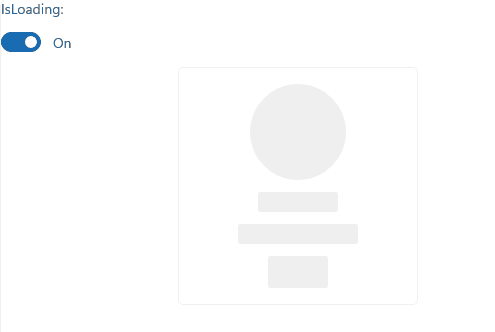
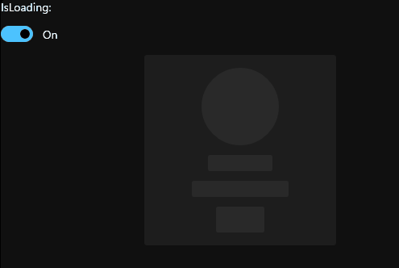

## ScopedButtonDisabler
```cpp
#include <ScopedButtonDisabler.hpp>
```
This is a simple header-only RAII-style class that disable a button in a scope.
When you attach a `Click` handler of a button and open a `FilePicker`, when user click fast enough, it will have 2 `FilePicker` opened at the same time, which is a source of logical bugs.
```cpp
winrt::Windows::Storage::Pickers::FileOpenPicker picker;
picker.FileTypeFilter().Append(L"*");
auto file = co_await picker.PickSingleFileAsync();
```

With `ScopedButtonDisabler`, it will disable the button inside this handler, preventing any logical bugs that might happens.
```cpp
ScopedButtonDisabler disabler{ sender };
winrt::Windows::Storage::Pickers::FileOpenPicker picker;
picker.FileTypeFilter().Append(L"*");
auto file = co_await picker.PickSingleFileAsync();
```


## ImageExtension
Automatically display a fallback image when `Image` failed to load.
Usage:

```xml
<Image
    essential:ImageExtension.FallbackSource="ms-appx:///Assets/Owl.jpg"
    Source="https://upload.wikimedia.org/wikipedia/commons/5/5f/Windows_logo_-_2012.svg" />
```

## SwitchPresenter
Almost the same as community's `SwitchPresenter`. But lacking reflection in C++ means you need to explicitly write out the value type in xaml in `Case.Value` property.

For example, if you binding the `SwitchPresenter.Value` to a `Boolean`, you need to write the `Case.Value` to `<x:Boolean>True</x:String>`:
```xml
<essential:SwitchPresenter Value="{Binding IsOn, ElementName=LoadingState, Mode=OneWay}">
    <essential:Case>
        <essential:Case.Value>
            <x:Boolean>True</x:Boolean>
        </essential:Case.Value>
        <TextBlock Text="True value content">
    </essential:Case>
</essential:SwitchPresenter>
```
You should most likely use `Binding` instead of `x:Bind`, because when `{x:Bind}` is evaluated the controls are not finished loading, causing a crash

## ModernStandardWindowContextMenu
A modern XAML-based window context menu to replace the traditional win32 menu when you right-click the window titlebar. 
It supports uses on both `Essential:WindowEx` and a normal `Microsoft.UI.Xaml.Window`. 
The icons are hard-coded glyphs so you get the same appearance on both Windows 10 & Windows 11.
It also listens to window style changes, so it shows the correct menu item in whatever window styles your window have.
To use it, first put a resource in your `App.xaml` `ResourceDictionary.MergedDictionary`
```xml
<Application>
    <Application.Resources>
        <ResourceDictionary>
            <ResourceDictionary.MergedDictionaries>
                <ResourceDictionary Source="ms-appx:///WinUI3Package/ModernStandardWindowContextMenu_Resource.xaml" />
                ...
            </ResourceDictionary.MergedDictionaries>
        </ResourceDictionary>
    </Application.Resources>
</Application>
```
- To use with a `essential:Window`, simply set it to `WindowEx.ContextMenu`
```xml
<essential:WindowEx ...
    <essential:WindowEx.ContextMenu>
        <!--  Simply set it to WindowEx.ContextMenu  -->
        <essential:ModernStandardWindowContextMenu />
    </essential:WindowEx.ContextMenu>
</essential:WindowEx>
```
- To use with a `Microsoft.UI.Xaml.Window`, declare it as a `Resource` with a `x:Name` and `{x:Bind}` to `ModernStandardWindowContextMenu.Window` property 
  under **the first element in the window context**
```xml
<Window ...>
    <StackPanel>
        <StackPanel.Resources>
            <!--  Simply declare it as resource in your first control of the window  -->
            <essential:ModernStandardWindowContextMenu x:Name="Menu" Window="{x:Bind}" />
        </StackPanel.Resources>
    </StackPanel>
</Window>
```

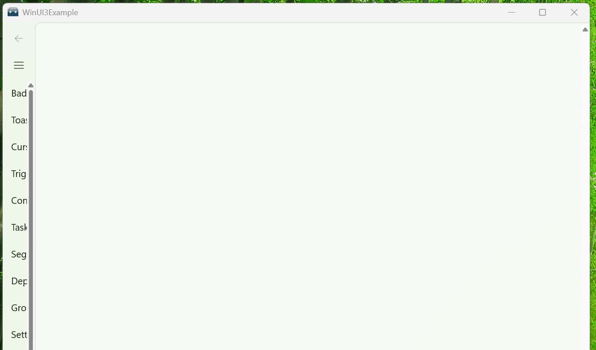

## WindowContextMenu
A customized version of `ModernStandardWindowContextMenu` that allows you to use a custom `MenuFlyout` with any items you'd like.
Usage are largely the same to `ModernStandardWindowContextMenu`, that you still bind a `Window` with `{x:Bind}`,
but you do not need to add a resource to `Application.Resources`
```xml
<Window ...>
    <StackPanel>
        <StackPanel.Resources>
            <essential:WindowContextMenu x:Name="Menu" Window="{x:Bind}">
                <MenuFlyout>
                    <MenuFlyoutItem Text="Item1" />
                    <MenuFlyoutItem Text="Item2" />
                </MenuFlyout>
            </essential:WindowContextMenu>
        </StackPanel.Resources>
    </StackPanel>
</Window>
```

## NonResizableWindowWhiteBorderWorkaround
WASDK 1.6 has [this issue](https://github.com/microsoft/microsoft-ui-xaml/issues/9978) that window has a white border when you `SetBorderAndTitleBar(false, false)`.
This controls helps to workaround it by providing a simple syntax you declare right in your window's first element's `Resource`
```xml
<Window ...>

    <StackPanel>
        <StackPanel.Resources>
            <essential:NonResizableWindowWhiteBorderWorkaround x:Name="Workaround" Window="{x:Bind}" />
        </StackPanel.Resources>
    </StackPanel>
</Window>
```

Before:

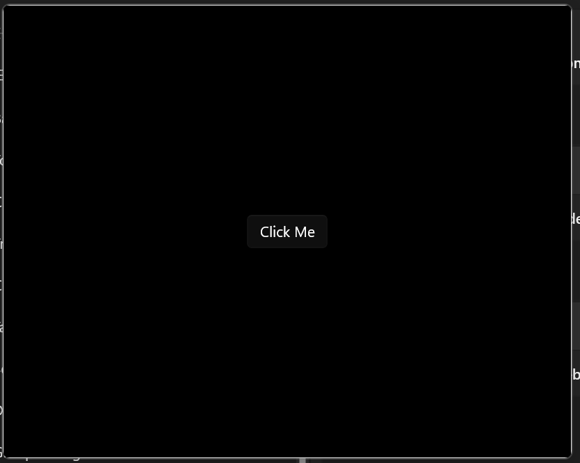

After:

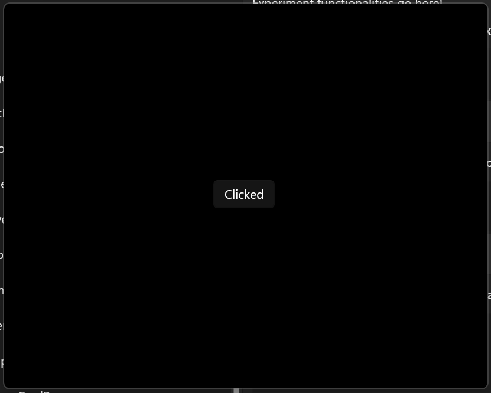

## ComboBoxHelper
The WinUI3's built-in `ComboBox` does not have [Acrylic background](https://github.com/microsoft/microsoft-ui-xaml/issues/9523). We fixed it for you. To use it, simply add `ComboBoxHelper.AcrylicWorkaround="True"` as an attached property on your `ComboBox`.

```xml
<ComboBox
    Width="200"
    essential:ComboBoxHelper.AcrylicWorkaround="True"
    Header="Colors"
    PlaceholderText="Pick a color">
    <x:String>Blue</x:String>
    <x:String>Green</x:String>
    <x:String>Red</x:String>
    <x:String>Yellow</x:String>
</ComboBox>
```
|Before|After|
|------|-----|
|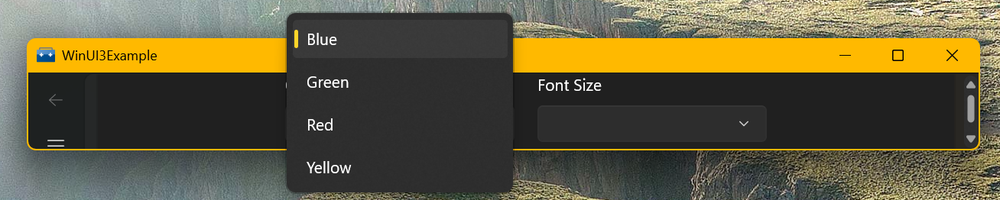|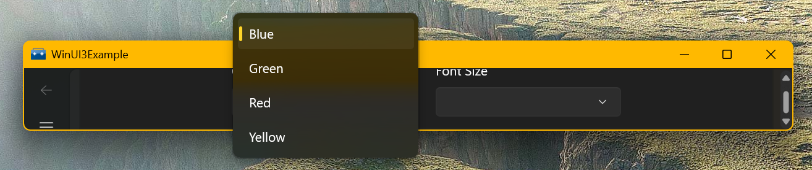|

## AutoSuggestBoxHelper
The WinUI3's built-in `AutoSuggestBox` does not have [Acrylic background](https://github.com/microsoft/microsoft-ui-xaml/issues/10590). We fixed it for you. To use it, simply add `AutoSuggestBoxHelper.AcrylicWorkaround="True"` as an attached property on your `AutoSuggestBox`.

```xml
<AutoSuggestBox x:Name="Control2" Width="300"
    essential:AutoSuggestBoxHelper.AcrylicWorkaround="True"/>
```
|Before|After|
|------|-----|
|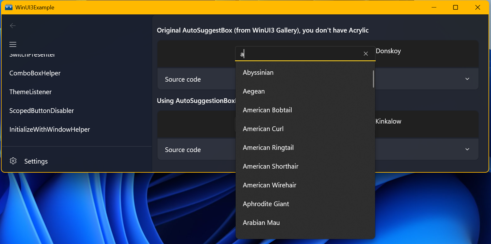|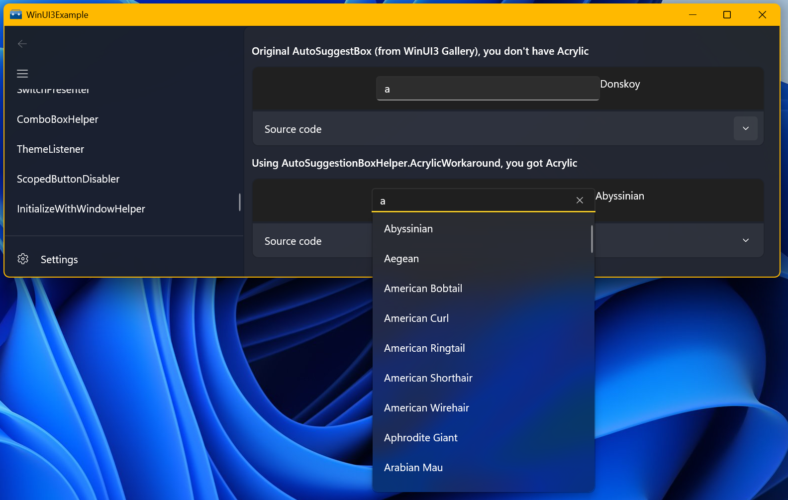|

## WrapPanel
A panel that position child elements from left to right first then wrap to new row when the width is not enough.
Switching orientation to position child elements from top to bottom first then wrap to new column when the height is not enough.

A better implementation to community toolkit that does NOT crash!

Usage:
```xml
 <ListView ItemsSource="{x:Bind WrapPanelCollection, Mode=OneWay}">
    <ListView.ItemsPanel>
        <ItemsPanelTemplate>
            <essential:WrapPanel x:Name="sampleWrapPanel" />
        </ItemsPanelTemplate>
    </ListView.ItemsPanel>
</ListView>
```


## ToolTipHelper
The WinUI3's built-in `ToolTip` does not have Acrylic background. We fixed it for you. To use it, simply add `ToolTipHelper.AcrylicWorkaround="True"` as an attached property on your `ToolTip`.
```xml
<Button Content="Button with a simple ToolTip.">
    <ToolTipService.ToolTip>
        <ToolTip essential:ToolTipHelper.AcrylicWorkaround="True" Content="Simple ToolTip" />
    </ToolTipService.ToolTip>
</Button>
```
|Before|After|
|------|-----|
|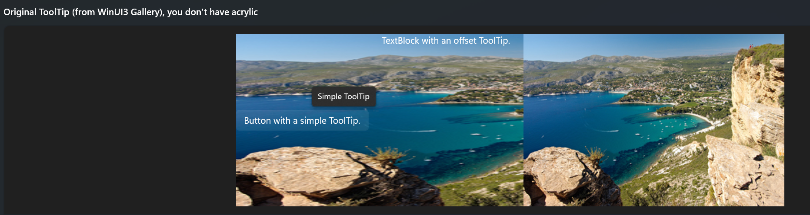|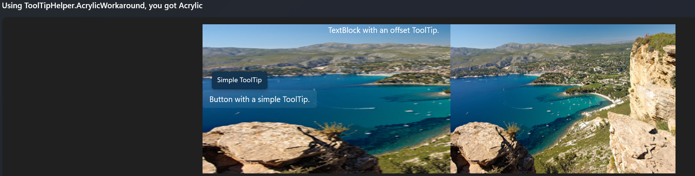|

## CommandBarHelper
The WinUI3's built-in `CommandBar` does not have Acrylic background. We fixed it for you. To use it, simply add `CommandBarHelper.AcrylicWorkaround="True"` as an attached property on your `CommandBar`.
```xml
<CommandBar essential:CommandBarHelper.AcrylicWorkaround="True">
    <AppBarButton Icon="Add" Label="Add"/>
    <AppBarButton Icon="Edit" Label="Edit"/>
    <AppBarButton Icon="Delete" Label="Delete"/>
</CommandBar>
```
|Before|After|
|------|-----|
|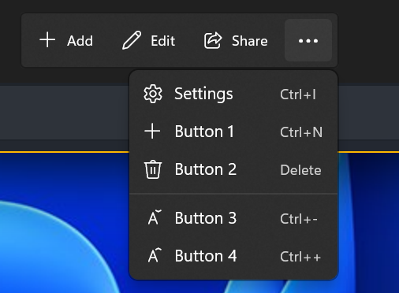|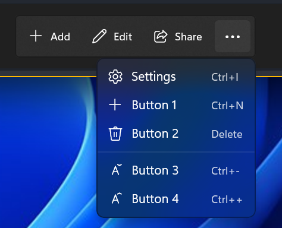|

## IInitializeWithWindowHelper
A header-only helper for [initializing](https://learn.microsoft.com/en-us/windows/apps/develop/ui-input/display-ui-objects) WinRT objects that requires a `hwnd`.

To use, simply change the namespace `winrt` to `WinUIEssentials` of your objects that needs to be initialized, and pass either a `HWND` or a `Microsoft.UI.Xaml.Window` to the constructor.

Take `FileOpenPicker` as an example:
```cpp
#include <include/IInitializeWithWindowHelper.hpp>

WinUIEssentials::Windows::Storage::Pickers::FileOpenPicker picker{ MainWindow::Hwnd };
//or
WinUIEssentials::Windows::Storage::Pickers::FileOpenPicker picker{ MainWindow::Instance };

//...
picker.PickSingleFileAsync();
```

## WindowCaptionButtonThemeWorkaround
When you have `Window.ExtendsContentIntoTitleBar(true)`, the caption buttons often comes out with broken color regarding to theme. 
This helper fixed it by working as a hidden control and listens to theme change message, and make corresponding changes to caption buttons.

To use, simply put it under a Xaml control (such as `Grid`) that can accept child contents.

```xml
<Window>
    ...
    <Grid x:Name="RootGrid">
        <essential:WindowCaptionButtonThemeWorkaround Window="{x:Bind}" />
        <-- Other contents -->
    </Grid>
</Window>
```

|Before|After|
|------|-----|
|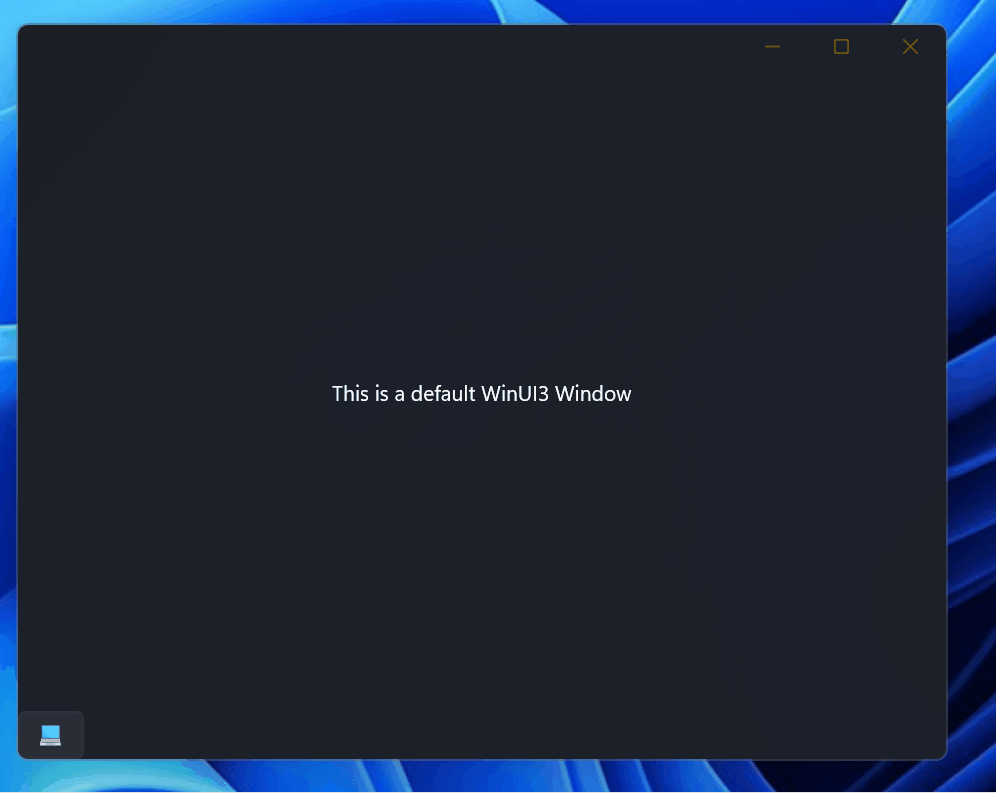|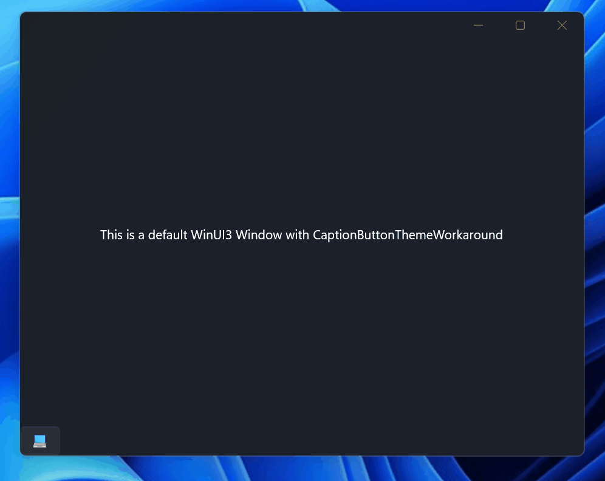|

## MicaBackdropWithFallback
The default mica backdrop, but with automatic fallback to any other kind of backdrop (mainly `DesktopAcrylicBackdrop` from WASDK).

Usage: 
```xml
<Window.SystemBackdrop>
    <essential:MicaBackdropWithFallback>
        <essential:MicaBackdropWithFallback.Fallback>
            <DesktopAcrylicBackdrop />
        </essential:MicaBackdropWithFallback.Fallback>
    </essential:MicaBackdropWithFallback>
</Window.SystemBackdrop>
```

## NonMaximizableWindowWorkaround
Helper for workaround setting `IsMaximizable=false` but you are still able to maximize the window but double-tapping on the title bar.


Simply delcare it under any `Resource` under a control that is inside a `Window`. Usage:
```xml
<Window ...>
    <StackPanel>
        <StackPanel.Resource>
            <essential:NonMaximizableWindowWorkaround Window="{x:Bind}"/>
        </StackPanel.Resource>
    </StackPanel>
    ...
</Window>
```

## DatePickerHelper
The WinUI3's built-in `DatePicker` does not have Acrylic background. We fixed it for you. To use it, simply add `DatePickerHelper.AcrylicWorkaround="True"` as an attached property on your `DatePicker`.
```xml
<DatePicker essential:DatePickerHelper.AcrylicWorkaround="True" Header="Pick a date" />
```
|Before|After|
|------|-----|
||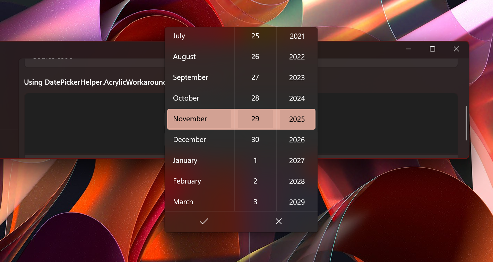|

## TimePickerHelper
The WinUI3's built-in `TimePicker` does not have Acrylic background. We fixed it for you. To use it, simply add `TimePickerHelper.AcrylicWorkaround="True"` as an attached property on your `TimePicker`.
```xml
<TimePicker essential:TimePickerHelper.AcrylicWorkaround="True" Header="Pick a time" />
```
|Before|After|
|------|-----|
|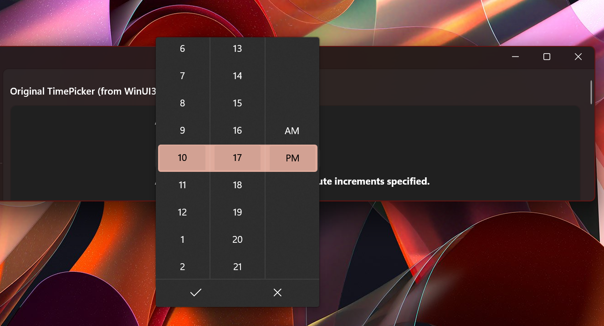|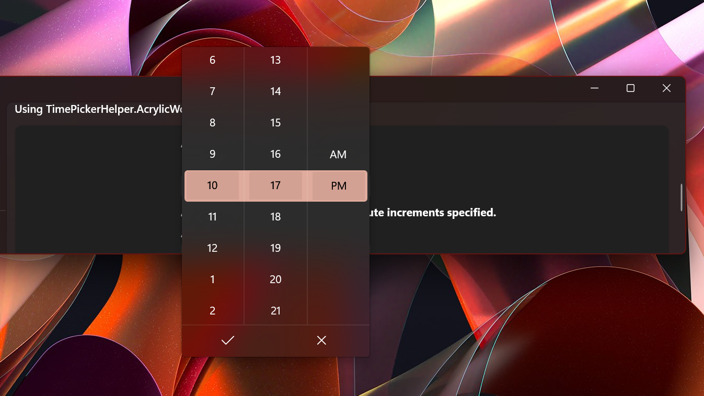|

## FlyoutHelper
The WinUI3's built-in `Flyout` does not have Acrylic background. We fixed it for you. To use it, simply add `Flyout.AcrylicWorkaround="True"` as an attached property on your `Flyout`.
```xml
<Flyout essential:FlyoutHelper.AcrylicWorkaround="True">
    <StackPanel>
        <TextBlock
            Margin="0,0,0,12"
            Style="{ThemeResource BaseTextBlockStyle}"
            Text="All items will be removed. Do you want to continue?" />
        <Button Content="Yes, empty my cart" />
    </StackPanel>
</Flyout>
```
|Before|After|
|------|-----|
|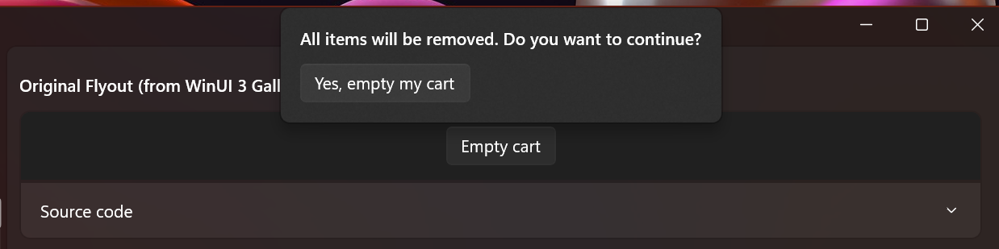||

## CalendarDatePickerHelper
The WinUI3's built-in `TimePickerHelper` does not have Acrylic background. We fixed it for you. To use it, simply add `TimePickerHelper.AcrylicWorkaround="True"` as an attached property on your `TimePickerHelper`.
```xml
<CalendarDatePicker
    essential:CalendarDatePickerHelper.AcrylicWorkaround="True"
    Header="Calendar"
    PlaceholderText="Pick a date" />
```
|Before|After|
|------|-----|
|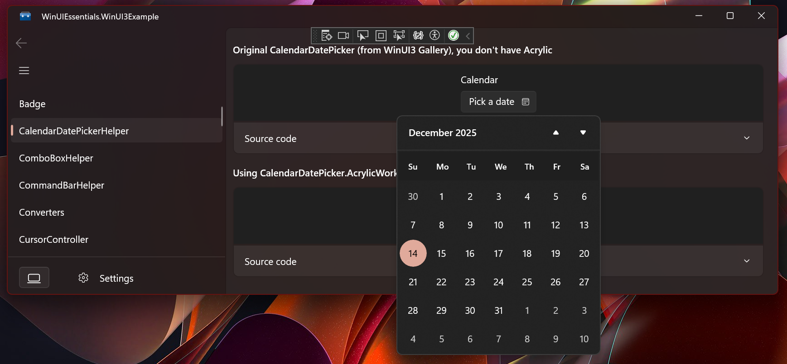|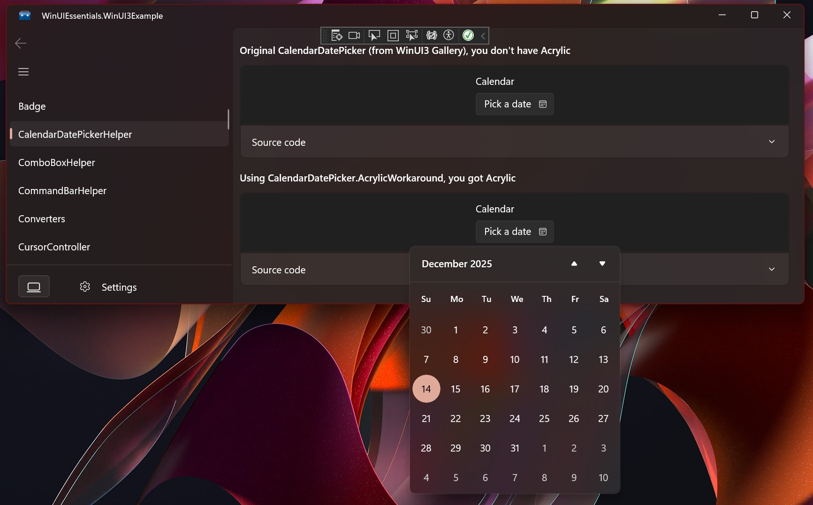|

## ModalWindow
A WinUI3 modal window (meaning that it has an owner window, and take its focus) that you can directly use in xaml, just like the good-ol `Window`.
```xml
<essential:ModalWindow
    x:Class="WinUI3Example.SampleModalWindow"
    xmlns="http://schemas.microsoft.com/winfx/2006/xaml/presentation"
    xmlns:x="http://schemas.microsoft.com/winfx/2006/xaml"
    xmlns:d="http://schemas.microsoft.com/expression/blend/2008"
    xmlns:essential="using:WinUI3Package"
    xmlns:local="using:WinUI3Example"
    xmlns:mc="http://schemas.openxmlformats.org/markup-compatibility/2006"
    Title="Sample Modal Window"
    mc:Ignorable="d">

    <TextBlock Text="This is a ModalWindow" />
</essential:ModalWindow>
```

## NavigationViewHelper
The WinUI3's built-in `NavigationView` does not have Acrylic background with the dropdown menu and the overflow menu when it's at top. We fixed it for you. To use it, simply add `TimePickerHelper.AcrylicWorkaround="True"` as an attached property on your `NavigationView` when it has `PaneDisplayMode="Top"`.
```xml
<NavigationView
    ...
    essential:NavigationViewHelper.AcrylicWorkaround="True"
    PaneDisplayMode="Top">

    ...Other contents...
</NavigationView>
```
|Before|After|
|------|-----|
|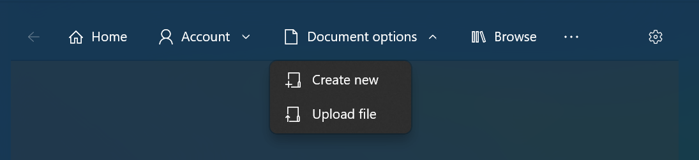|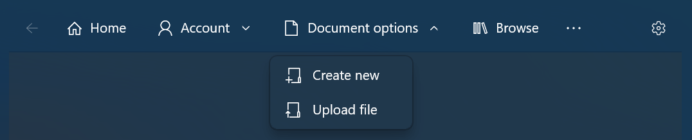|


## RevealFocusPanel
Missing the good-ol Reveal Focus effect from UWP? We bring it back to you! For detailed usage, please download the [Example Gallery](https://apps.microsoft.com/detail/9PCC690BCMT9?hl=en-us&gl=US&ocid=pdpshare) and see for yourself!
|Light|Dark|
|-----|----|
|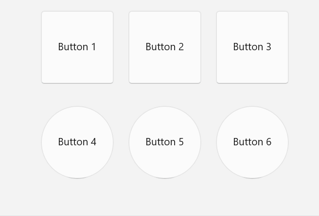|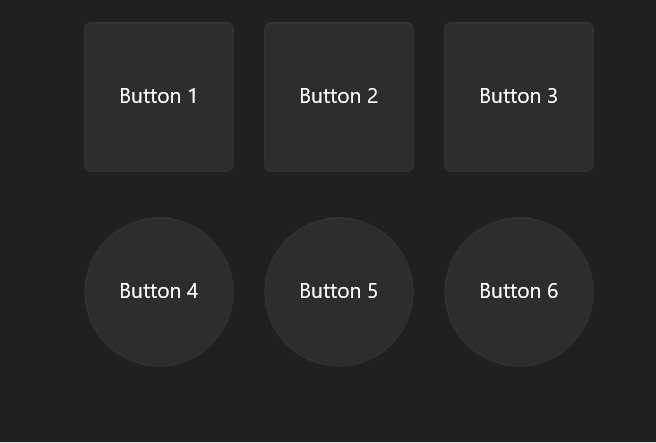|
|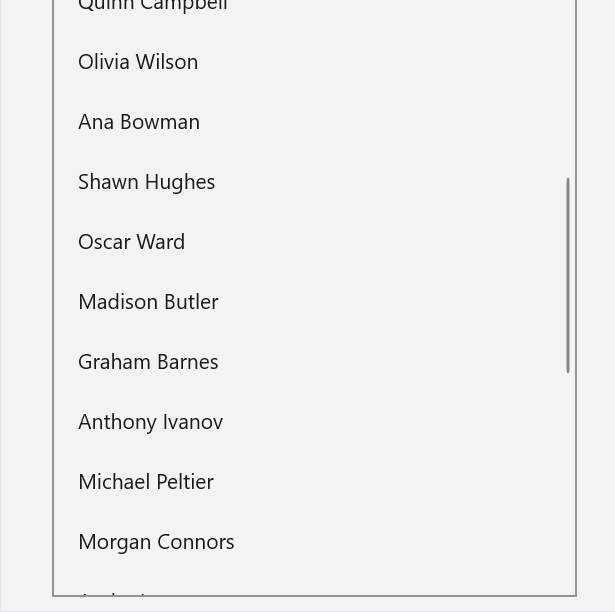|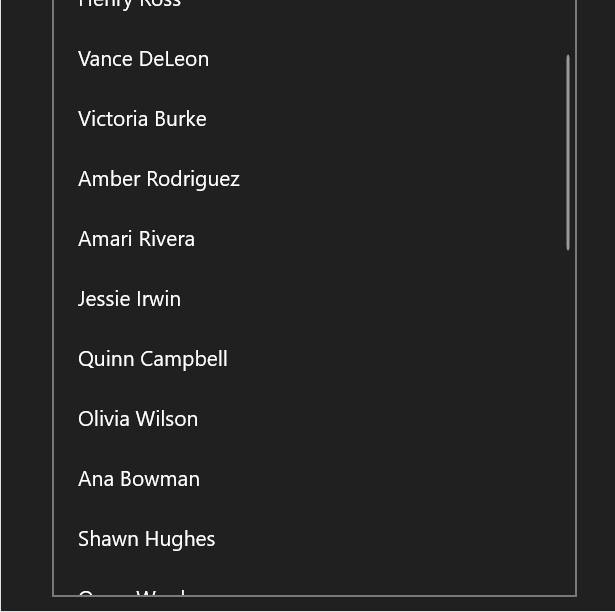|
|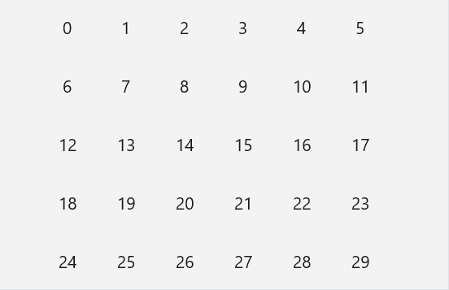|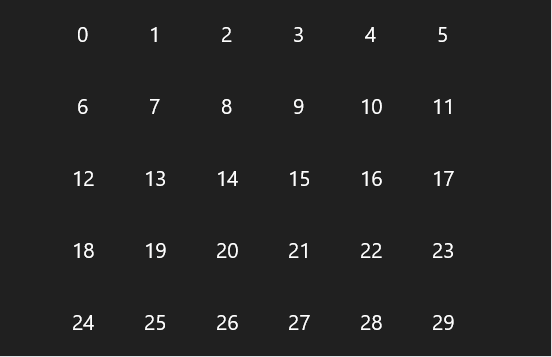|