 
# WinUI Essentials
A repo dedicated for simplifying C++ development with WinUI2 (Universal Windows Platform) and WinUI3 (Windows App SDK).

## Nuget

For UWP: [](https://www.nuget.org/packages/WinUIEssential.UWP)

For WinUI3 (Windows App SDK): [](https://www.nuget.org/packages/WinUIEssential.WinUI3)

UWP Svg: [](https://www.nuget.org/packages/WinUIEssential.UWP.Svg)

WinUI3 Svg: [](https://www.nuget.org/packages/WinUIEssential.WinUI3.Svg)


## Example Gallery
### WinUI3
[Download from Microsoft Store!](https://apps.microsoft.com/detail/9PCC690BCMT9)


<a href="https://get.microsoft.com/installer/download/9pcc690bcmt9?referrer=appbadge" target="_self" >
	
</a>

### UWP
[Download from Microsoft Store!](https://apps.microsoft.com/detail/9pg350gp1tbf)

<a href="https://get.microsoft.com/installer/download/9pg350gp1tbf?referrer=appbadge" target="_self" >
	
</a>

---
Example project build status:

|Platform|Debug|Release|
|---|---|---|
|x86| [](https://github.com/HO-COOH/WinUIEssentials/actions/workflows/build-debug-x86.yml) | [](https://github.com/HO-COOH/WinUIEssentials/actions/workflows/build-release-x86.yml)
|x64| [](https://github.com/HO-COOH/WinUIEssentials/actions/workflows/build-debug-x64.yml) | [](https://github.com/HO-COOH/WinUIEssentials/actions/workflows/build-release-x64.yml)
|~~ARM~~| ~~[)](https://github.com/HO-COOH/WinUIEssentials/actions/workflows/build.yml)~~ | ~~[)](https://github.com/HO-COOH/WinUIEssentials/actions/workflows/build.yml)~~
|ARM64| [](https://github.com/HO-COOH/WinUIEssentials/actions/workflows/build-debug-arm64.yml) | [](https://github.com/HO-COOH/WinUIEssentials/actions/workflows/build-release-arm64.yml)


## Usage
> [!NOTE]
> Update since WinEssential.WinUI3 1.5, you do NOT need to add control resources in `Application.Resources`!


> [!WARNING]
> Make sure to set your C++ language version to C++20 first!

Open the `WinUIEssential.sln` containing 4 projects:
- UWPPackage (project for WinUIEssential.UWP nuget package)
- UWPExample (example gallery for using the above package)
- WinUI3Package (project for WinUIEssential.WinUI3 nuget package)
- WinUI3Example (example gallery for using the above package)

Build the `*Package` project will build the project and pack it with nuget, then install the nuget to your project and start using it.

To build the `*Example` project, do the same thing. They did not reference `*Package` for demo purposes.

> [!NOTE]
> Functionalities for UWP and WinUI3 should be exactly the same unless otherwise noted!

It should be useful until the [community toolkit](https://github.com/CommunityToolkit/WindowsCommunityToolkit) provides C++.

-----
## Build and contribute
### Build requirements
- You need to have [vcpkg](https://vcpkg.io/en/) installed and integrate setup for msbuild. See [this documentation for guide](https://learn.microsoft.com/en-us/vcpkg/get_started/get-started-msbuild?pivots=shell-powershell).
- You need to have Visual Studio **2026** with `Desktop development with C++` and `WinUI Application development` workload installed. (2022 will NOT work, as we are using the `v145` C++ tools)
- You need to build both `Debug` and `Release` build to successfully build and debug the example project (**this is intentional for not missing debug version of the package**)
- >= Windows 10 17763 (Actually I mostly use Windows 10 17763 to ensure compatibility that WinUI3 claims to support)

You can reference Github Action for detailed build steps.


### Contribute a new templated control
0. **DO NOT submit a PR that's purely AI written WITHOUT your reviewing.** I will **NOT** review it.
1. If it is a templated control, create a control with the `ViewModel` file template and a `ResourceDictionary` xaml file
2. Add an entry in the `WinUIEssential.WinU3.targets` so that the `.xbf` file is properly copied (see that file for example) 
3. Please also consider adding a demo page for the control, and add it to `MainWindow.xaml.h` `MainWindow::s_page` (see the file for example)

-----
## Content
|Component|UWP|WinUI3|Type
|--|--|--|--|
|WinUIIncludes| :white_check_mark: | :x: | Header only
|TemplateControlHelper| :white_check_mark: | :white_check_mark: | Header only
|BadgeGlyphs| :white_check_mark: | :white_check_mark: | Header only
|ToastTemplates| :white_check_mark: | :white_check_mark: | Header only
|ToastBuilder | :white_check_mark: | :white_check_mark: | Header only
|TileTemplates| :white_check_mark: | :white_check_mark: | Header only
|TileBuilder | :white_check_mark: | :white_check_mark: | Header only
|CursorController | :white_check_mark: | :white_check_mark: | WinRT component
|PropertyChangeHelper | :white_check_mark: | :white_check_mark: | Header only
|NegateBoolConverter | :white_check_mark: | :white_check_mark: | WinRT component
|BoolToVisibilityConverter | :white_check_mark: | :white_check_mark: | WinRT component
|ContainerToBoolConverter | :white_check_mark: | :white_check_mark: | WinRT component
|StringToBoolConverter | :white_check_mark: | :white_check_mark: | WinRT component
|ReferenceToBoolConverter | :white_check_mark: | :white_check_mark: | WinRT component
|ConverterGroup | :white_check_mark: | :white_check_mark: | WinRT component
|Convert | :white_check_mark: | :white_check_mark: | WinRT component
|IsEqualStringTrigger| :white_check_mark: | :white_check_mark: | WinRT component
|IsNullOrEmptyStateTrigger | :white_check_mark: | :white_check_mark: | WinRT component
|ControlSizeTrigger | :white_check_mark: | :white_check_mark: | WinRT component
|CharmBar | :white_check_mark: | :x: | WinRT component
|GroupBox | :white_check_mark: | :white_check_mark: | Control
|SettingsCard | :white_check_mark: | :white_check_mark:* | Control
|SettingsExpander | :white_check_mark: | :white_check_mark:* | Control
|FontIconExtension | :white_check_mark: | :white_check_mark: | WinRT component
|DependentValue| :white_check_mark: | :white_check_mark: | WinRT component
|Taskbar| :x: | :white_check_mark: | Header only
|MarqueeText | :white_check_mark: | :white_check_mark: | Control
|ProgressBarEx | :white_check_mark: | :white_check_mark: | Control
|WindowEx | :x: | :white_check_mark: | Window
|TransparentBackdrop | :x: | :white_check_mark: | SystemBackdrop
|Segmented | :white_check_mark: | :white_check_mark: | Control
|CustomMicaBackdrop | :x: | :white_check_mark: | Backdrop
|CustomAcrylicBackdrop | :x: | :white_check_mark: | Backdrop
|Shimmer | :white_check_mark: | :white_check_mark: | Control
|ImageExtension | :white_check_mark: | :white_check_mark: | WinRT component
|SwitchPresenter | :white_check_mark: | :white_check_mark: | Control
|ModernStandardWindowContextMenu| :x: | * :white_check_mark: | WinRT component
|WindowContextMenu | :x: | :white_check_mark: | WinRT component
|NonResizableWindowWhiteBorderWorkaround | :x: | :white_check_mark: | WinRT component
|ComboBoxHelper | :x: | :white_check_mark: | WinRT component
|AutoSuggestBoxHelper | :x: | :white_check_mark: | WinRT component
|WrapPanel | :white_check_mark: | :white_check_mark: | Panel
|ToolTipHelper | :x: | :white_check_mark: | WinRT component
|CommandBarHelper | :x: | :white_check_mark: | WinRT component
|IInitializeWithWindowHelper | :x: | :white_check_mark: | Header only
|WindowCaptionButtonThemeWorkaround | :white_check_mark: | :white_check_mark: | WinRT component
|MicaBackdropWithFallback | :x: | :white_check_mark: | WinRT component
|NonMaximizableWindowWorkaround | :x: | :white_check_mark: | WinRT component
|DatePickerHelper | :x: | :white_check_mark: | WinRT component
|TimePickerHelper | :x: | :white_check_mark: | WinRT component
|FlyoutHelper | :x: | :white_check_mark: | WinRT component
|CalendarDatePickerHelper | :x: | :white_check_mark: | WinRT component
|ModalWindow | :x: | :white_check_mark: | WinRT component
|NavigationViewHelper | :x: | :white_check_mark: | WinRT component
|SliderHelper | :x: | :white_check_mark: | WinRT component
|RevealFocusPanel | :x: | :white_check_mark: | Control
|TenMica | :x: | :white_check_mark: | WinRT component
|WindowedContentDialog | :x: | :white_check_mark: | Control
|SvgImageSource | :white_check_mark: | :white_check_mark: | WinRT component
|WebView | :x: | :white_check_mark: | Control
|Table | :white_check_mark: | :white_check_mark: | Control

*means additional settings required, see the sections for info

---
## WinUIIncludes
Include the WinUI2 headers in your `pch.h`, so you don't waste your time figuring out where the compilation error comming from./

Usage:
Add this in your `pch.h`
```cpp
#include <WinUIIncludes.hpp>
```

## TemplateControlHelper
Automatically call `DefaultStyleKey()` for your templated control so you don't waste your time when you forget to include this line and get an empty control.

Usage: Inherit this class in your header file, make the template argument your **implementation type**.
```cpp
#include <TemplateControlHelper.hpp>
...
struct MyControl : MyControlT<MyControl>, TemplateControlHelper<MyControl>
{
    ...
};
```

## ToastHelper
Helper for creating toast notifications.

### ToastTemplates --- *namespace `ToastTemplates`*
The [built-in templates](https://learn.microsoft.com/en-us/uwp/api/windows.ui.notifications.toasttemplatetype?view=winrt-22621) re-written to strongly-typed classes that derived from `winrt::Windows::UI::Notification::ToastNotification`, so that you can directly use them as arguments for`winrt::Windows::UI::Notifications::ToastNotificationManager`. Example usage:
```cpp
#include <ToastTemplates.hpp>
winrt::Windows::UI::Notifications::ToastNotificationManager::CreateToastNotifier()
    .Show(ToastTemplates::ImageWithHeaderAndBody{ L"ms-appx:///Assets/Windows 11.png", L"Header", L"body" });
//alternatively use Microsoft's template name
winrt::Windows::UI::Notifications::ToastNotificationManager::CreateToastNotifier()
    .Show(ToastTemplates::ToastImageAndText02{ L"ms-appx:///Assets/Windows 11.png", L"Header", L"body" });
```

|Type|Template Name(which can also be used as type)|Sample|
|--|--|--|
|`BodyTextOnly`| `ToastText01` | 
|`SingleLineHeaderWithBody`| `ToastText02`| 
|`TwoLineHeaderWithBody`| `ToastText03`| 
|`HeaderWithTwoSingleLineBody`| `ToastText04`| 
|`ImageWithBodyOnly`| `ToastImageAndText01`| 
|`ImageWithHeaderAndBody`| `ToastImageAndText02`| 
|`ImageWithTwoLineHeaderAndBody`| `ToastImageAndText03`| 
|`ImageWithHeaderAndTwoSingleLineBody`| `ToastImageAndText04`| 

### ToastBuilder --- *namespace `ToastBuilder`*
Strongly-typed, declarative toast notification elements to quickly build toast notifications, as if you are writing XAML. [Schema here.](https://learn.microsoft.com/en-us/uwp/schemas/tiles/toastschema/root-elements) 
Example usage:
<table>
<tr>
    <td>XML</td> <td>C++</td>
<tr>
<tr>
<td>

```xml
<toast duration="long" scenario="reminder" useButtonStyle="true">
    <visual>
        <binding template="ToastText04">
            <text id="1">headline</text>
            <text id="2">body text1</text>
            <text id="3">body text2</text>
        </binding>
    </visual>
    <actions>
        <action content="Accept" arguments="accept"/>
    </actions>
</toast>
```
</td>
<td>

```cpp
Toast().Duration(Long).Scenario(Reminder).UseButtonStyle(true)
(
    Visual()
    (
        Binding().Template(L"ToastText04")
        (
            Text().Id(1)(L"headline"),
            Text().Id(2)(L"body text1"),
            Text().Id(3)(L"body text2")
        )
    ),
    Actions()
    (
        Action().Content(L"Accept").Arguments(L"accept")
    )
)
```

</td>
</tr>
<tr>
<td>

`<tag>...content...</tag>`

</td>
<td>

`Tag()(...content...)`

</td>
</tr>
<tr>
<td>

`attribute="value"`

</td>
<td>

`.Attribute(value)`

</td>
</tr>
<table>

Optionally add a handler to `Action` so you can handle toast notification button click right on site. For more info, see the comment documentation.
```cpp
Actions()
(
    Action().Content(L"Accept").Arguments(L"accept")
    .Click([this](winrt::Windows::ApplicationModel::Activation::ToastNotificationActivatedEventArgs args)
    {
        //Handle Accept button
    }),
    Action().Content(L"Cancel").Arguments(L"cancel")
    .Click([this](winrt::Windows::ApplicationModel::Activation::ToastNotificationActivatedEventArgs args)
    {
        //Handle Cancel button
    })
)
```

## TileTemplates --- *namespace `TileTemplates`*
Similar to [ToastTemplates](#ToastHelper), but for strongly-typed tile templates.

## TileBuilder --- *namespace `TileBuilder`*
Similar to [ToastBuilder](#ToastHelper), but for building tiles.

## Glphys --- *namespace `Glyphs`*
Font glyphs value for Segoe MDL2 Assets fonts. Usage:
```cpp
#include <Glyphs.hpp>
FontIcon().Glyph(Glyphs::GlobalNavButton);
```

## CursorController --- *namespace `CursorController`*
Xaml helper for controlling the cursor type when mouse enters. 
Value for `Type` is [CoreCursorType enum](https://learn.microsoft.com/en-us/uwp/api/windows.ui.core.corecursortype?view=winrt-22621). Usage:
```xml
xmlns:essential="using:WinUI3Package"
...
<Rectangle Fill="Red" essential:CursorController.Type="Hand"/>
```

## PropertyChangeHelper --- *namespace `MvvmHelper`*
Helper for `OneWay` binding.

Usage: 
1. Inherit `Windows.UI.Xaml.Data.INotifyPropertyChanged` in `idl`
```
[default_interface]
runtimeclass MyPage : Windows.UI.Xaml.Controls.Page, Windows.UI.Xaml.Data.INotifyPropertyChanged
{
    ...
};
```

2. Inherit from this class in the implementation class.
```cpp
/*MyPage.xaml.h*/
#include <include/PropertyChangeHelper.hpp>

namespace winrt::<MyProject>::implementation
{
    struct MyPage : MyMusicT<MyMusic>, MvvmHelper::PropertyChangeHelper<MyMusic>
    {
        int m_value;
        void Value(int newValue)
        {
            compareAndRaise(m_value, newValue, L"Value");
        };
    }
}
```

## Converters
- bool -> Visibility *namespace `BoolToVisibilityConverter`*
- bool negation *namespace `NegateBoolConverter`*
- container (IVector, IMap) -> bool *namespace `ContainerToBoolConverter`*
- reference (any WinRT runtime type) -> bool *namespace `ReferenceToBoolConverter`*
- String -> bool *namespace `StringToBoolConverter`*
- ConverterGroups *namespace `ConverterGroups`*:
  + define series of converters, that convert value from converter1 -> converter2 -> ...
  + usage:
  ```xml
   <essential:ConverterGroup x:Key="StringToVisibilityConverter">
       <essential:StringToBoolConverter/>
       <essential:BoolToVisibilityConverter/>
   </essential:ConverterGroup>
  ```

And most of the time when you are NOT using `ConverterGroup`, you should consider using the static functions in `Convert` class.
All of the above converters have corresponding static functions in `Convert` that you can use with `x:Bind` directly. Here are the complete list.
```
runtimeclass Convert 
{
    static Single DoubleToSingle(Double value);
    
    static Boolean ContainerToBool(Windows.Foundation.Collections.IVector<Object> container);
    static Boolean ReferenceToBool(Object value);
    static Boolean StringToBool(String value);
    static Boolean VisibilityToBool(Microsoft.UI.Xaml.Visibility value);

    static Boolean ContainerToBoolReverse(Windows.Foundation.Collections.IVector<Object> container);
    static Boolean ReferenceToBoolReverse(Object value);
    static Boolean StringToBoolReverse(String value);
    static Boolean VisibilityToBoolReverse(Microsoft.UI.Xaml.Visibility value);

    static Microsoft.UI.Xaml.Visibility ContainerToVisibility(Windows.Foundation.Collections.IVector<Object> container);
    static Microsoft.UI.Xaml.Visibility ReferenceToVisibility(Object value);
    static Microsoft.UI.Xaml.Visibility StringToVisibility(String value);
    static Microsoft.UI.Xaml.Visibility BoolToVisibility(Boolean value);
    
    static Microsoft.UI.Xaml.Visibility ContainerToVisibilityReverse(Windows.Foundation.Collections.IVector<Object> container);
    static Microsoft.UI.Xaml.Visibility ReferenceToVisibilityReverse(Object value);
    static Microsoft.UI.Xaml.Visibility StringToVisibilityReverse(String value);
    static Microsoft.UI.Xaml.Visibility BoolToVisibilityReverse(Boolean value);

    static Boolean ReverseBool(Boolean value);
    static Microsoft.UI.Xaml.Visibility ReverseVisibility(Microsoft.UI.Xaml.Visibility value);

    static Int32 UInt32ToInt32(UInt32 value);
}
```

## BadgeGlyphs --- *namespace `BadgeGlyphs`*
Helpers for creating badge notification xml.
Usage:
```cpp
#include <include/BadgeGlyphs.hpp>

//glyph badge
winrt::Windows::UI::Notifications::BadgeUpdateManager::CreateBadgeUpdaterForApplication()
    .Update(BadgeGlyphs::MakeBadgeNotification(BadgeGlyphs::Alert));

//number badge
winrt::Windows::UI::Notifications::BadgeUpdateManager::CreateBadgeUpdaterForApplication()
    .Update(BadgeGlyphs::MakeBadgeNotification(1));
```

## Triggers
See the same class in [Community Toolkit](https://github.com/CommunityToolkit/Windows) for documentation.
### ControlSizeTrigger --- *namespace `ControlSizeTrigger`*
### IsEqualStringTrigger --- *namespace `IsEqualStringTrigger`*
Note: For the reason of lacking reflection, we cannot implement `IsEqualStateTrigger
### IsNullOrEmptyStateTrigger --- *namespace `IsNullOrEmptyStateTrigger`*

## SettingsCard --- *namespace `SettingsCard`*
See the same class in [Community Tookit](https://github.com/CommunityToolkit/Windows) for documentation.
- Add this to `App.xaml` (UWP)
```xml
<Application.Resources>
    <controls:XamlControlsResources>
        <controls:XamlControlsResources.MergedDictionaries>
            <ResourceDictionary Source="ms-appx:///UWPPackage/SettingsCard_Resource.xaml"/>
            ...
        </controls:XamlControlsResources.MergedDictionaries>
    </controls:XamlControlsResources>
</Application.Resources>
```

> [!NOTE]
> For WinUI3, add `#include #include <winrt/Microsoft.UI.Xaml.Controls.AnimatedVisuals.h>` to your `pch.h`

## SettingsExpander --- *namespace `SettingsExpander`*
See the same class in [Community Tookit](https://github.com/CommunityToolkit/Windows) for documentation.
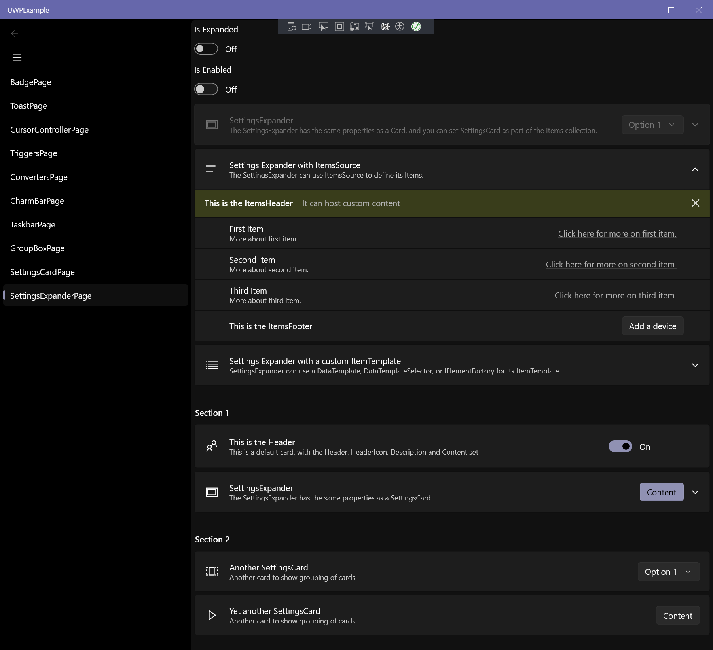
Add this to `App.xaml` (UWP)
```xml
<Application.Resources>
    <controls:XamlControlsResources>
        <controls:XamlControlsResources.MergedDictionaries>
            <ResourceDictionary Source="ms-appx:///UWPPackage/SettingsCard_Resource.xaml"/>
            <ResourceDictionary Source="ms-appx:///UWPPackage/SettingsExpander_Resource.xaml"/>
            ...
        </controls:XamlControlsResources.MergedDictionaries>
    </controls:XamlControlsResources>
</Application.Resources>
```

> [!NOTE]
> For WinUI3, add `#include #include <winrt/Microsoft.UI.Xaml.Controls.AnimatedVisuals.h>` to your `pch.h`

## CharmBar
Installing this nuget ~~will automatically add `Desktop Extension` to your UWP project~~ 
**then add a `      <WinUIEssentialAddDesktopExtension>true</WinUIEssentialAddDesktopExtension>` under `PropertyGroup` node in your `vcxproj` file**

so  you can use the good-ol Windows 8 style charm bar. This package further simplifies it's usage by allowing you to directly define local and global settings, directly in XAML containing UI element.

- Define a global setting in resource section, with `SettingsPaneEx.Settings`
```xml
<Application.Resources>
    <ResourceDictionary>
        <essential:SettingsPaneEx.Settings>
            <!--SettingsCommandEx items-->
            <essential:SettingsCommandEx Id="Item1" Label="Item123">
                <StackPanel>
                    <TextBlock Text="Text1 in item1"/>
                    <TextBlock Text="Text2 in item1"/>
                </StackPanel>
            </essential:SettingsCommandEx>=
            <essential:SettingsCommandEx Id="Item2" Label="Item456">
                <StackPanel>
                    <TextBlock Text="Text3 in item2"/>
                    <TextBlock Text="Text4 in item2"/>
                </StackPanel>
            </essential:SettingsCommandEx>
        </essential:SettingsPaneEx.Settings>
    </ResourceDictionary>
</Application.Resources>
```
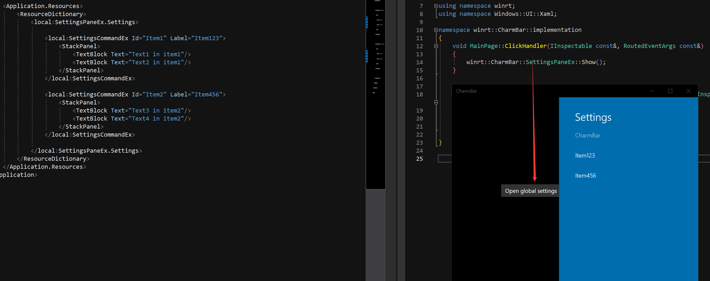
- Define local settings, where you put instance of `SettingsPaneEx` directly in UI as any other xaml controls.
```xml
<Page
    ...
>
    <StackPanel Orientation="Horizontal" HorizontalAlignment="Center" VerticalAlignment="Center">
        <essential:SettingsPaneEx x:Name="LocalSettings">
            <!--SettingsCommandEx items-->
            ...
        </essential:SettingsPaneEx>
    </StackPanel>
</Page>
```
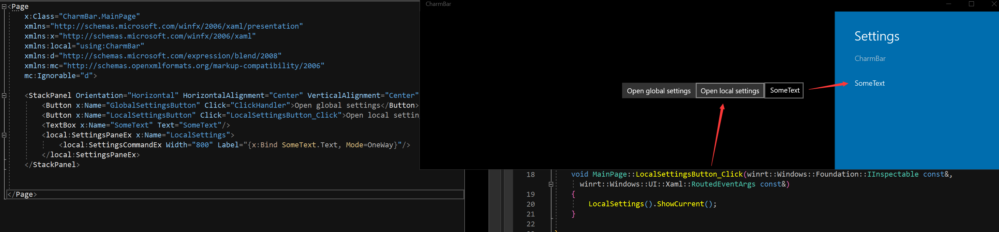

Define keyboard shortcuts with `SettingsPaneEx.KeyboardAccelerator` property.
```
<essential:SettingsPaneEx.KeyboardAccelerator>
    <KeyboardAccelerator Modifiers="Control" Key="s"/> <!-- Ctrl+S to open settings -->
</essential:SettingsPaneEx.KeyboardAccelerator>
```
## DependentValue ---*namespace `DependentValue`*
A wrapper around a `double` which you can target to with a `Storyboard` and `DoubleAnimation`, and get value out of it. Value is accessed by `.Value` property, which is a `DependencyProperty`, so you can do a `OneWay` binding to it or listen for value change notification.

> [!NOTE]
> Remember to set `EnableDependentAnimation="True"` to make it work!

Usage:
```xml
<Page.Resources>
    <essential:DependentValue x:Name="MyDoubleValue"/>
    <Storyboard x:Name="DoubleValueAnimation">
        <DoubleAnimation  
            From="0"
            To="100"
            Storyboard.TargetName="MyDoubleValue"
            Storyboard.TargetProperty="Value"
            EnableDependentAnimation="True"/>
    </Storyboard>
</Page.Resources>

<StackPanel Orientation="Horizontal" HorizontalAlignment="Center" VerticalAlignment="Center">
    <Button Click="ClickHandler">Click to start storyboard</Button>
    <TextBlock Text="{x:Bind MyDoubleValue.Value, Mode=OneWay}"/>
</StackPanel>
```

## Taskbar --- *namespace `Taskbar`*
Helper for setting taskbar status and progress. Usage:
```cpp
//Set taskbar status
Taskbar::SetProgressState(hwnd, Taskbar::ProgressState::Normal);
//Set taskbar progress value 
Taskbar::SetProgressValue(hwnd, 50); //a third optional parameter for total, default -> 100
```

## MarqueeText --- *namespace `MarqueeText`*
Enhanced version of `MarqueeText` in the community toolkit.
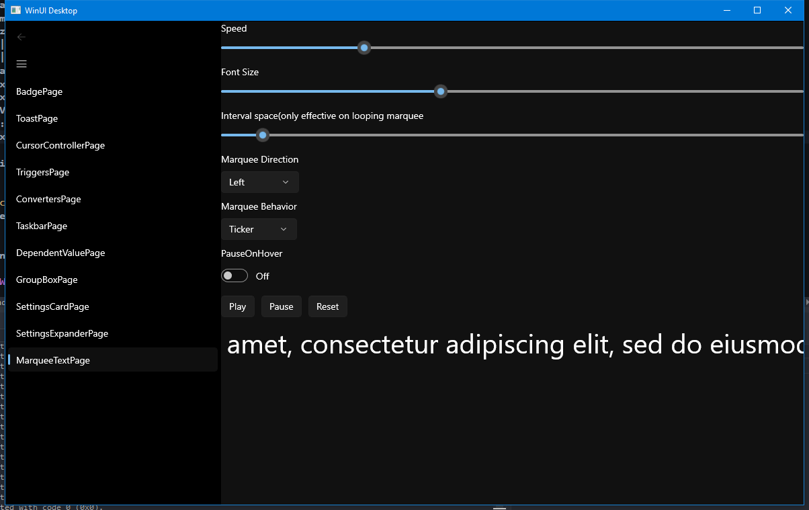


## ProgressBarEx --- *namespace `ProgressBarEx`*
A progress bar with animated highlight colors (and animated progress). Default to vista-like styles but also allows you to customize its color.

|Property| DependencyProperty? | Description
|---|---|---|
|HighColor | :white_check_mark: | the shimmer highlight color
|BaseColor | :white_check_mark: | the base background color of the finish part
|Background | :white_check_mark: | the color of the rest part
|Percent | :white_check_mark: | range: 0~100 
|Value | :white_check_mark: | normalized percent, range: 0.0~1.0

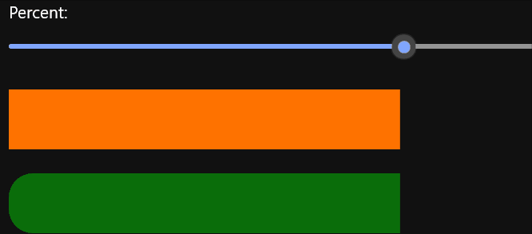
Add this to `App.xaml` (UWP)
```xml
<Application.Resources>
    <controls:XamlControlsResources>
        <controls:XamlControlsResources.MergedDictionaries>
            <ResourceDictionary Source="ms-appx:///Glyphs.xaml"/>
            ...
        </controls:XamlControlsResources.MergedDictionaries>
    </controls:XamlControlsResources>
</Application.Resources>
```

## WindowEx --- *namespace `WindowEx`*
### Basic Property
|name| DependencyProperty? | Description
|---|---|---|
|String Title| :white_check_mark: | Window title
|Boolean ExtendsContentIntoTitleBar| :white_check_mark: | ...
|Microsoft.UI.Xaml.Media.SystemBackdrop SystemBackdrop| :white_check_mark: | ...
|Double MinWidth| :white_check_mark: | Minimum width in DIP, inherited from `FrameworkElement`
|Double MaxWidth| :white_check_mark: | Maximum width in DIP, inherited from `FrameworkElement`
|Double MinHeight| :white_check_mark: | ...
|Double MaxHeight| :white_check_mark: | ...
|Double Width| :white_check_mark: | The whole window in DIP, the size Spy++ reports divided by the dpi scale
|Double Height| :white_check_mark: | ...
|Int32 RawWidth{ get; }| :x: | Actual width in pixel, raises `PropertyChanged`
|Int32 RawHeight{ get; }| :x: | Actual height in pixel, raises `PropertyChanged`
|UInt32 Dpi{ get; }| :x: | Current window dpi
|Int32 LeftInset{ get; }| :x: | Titlebar inset on the left in DIP
|Int32 RightInset{ get; }| :x: | Titlebar inset on the right in DIP
|Int32 LeftInsetRaw{ get; }| :x: | Same in pixel
|Int32 RightInsetRaw{ get; }| :x: | Same in pixel
|Boolean IsMinimizable| :white_check_mark: | ...
|Boolean IsMaximizable| :white_check_mark: | ...
|Boolean HasBorder| :white_check_mark: | ...
|Boolean HasTitleBar| :white_check_mark: | ...
|Boolean IsResizable| :white_check_mark: | ...
|Boolean IsAlwaysOnTop| :white_check_mark: | ...
|Boolean IsShownInSwitcher| :white_check_mark: | ...
|Microsoft.UI.Windowing.TitleBarHeightOption TitleBarHeight; | :white_check_mark: | ...
|String Icon| :white_check_mark: | Set `.ico` icon used for win32 titlebar
|Microsoft.UI.Xaml.Controls.MenuFlyout ContextMenu| :white_check_mark: | Win32 titlebar context menu, see [ModernStandardWindowContextMenu](#modernstandardwindowcontextmenu)
|Microsoft.UI.Xaml.Window Window{ get; }| :x: | The window hosting the control
|Microsoft.UI.Windowing.AppWindow AppWindow{ get; }| :x: | ...
|UInt64 Hwnd{ get; }| :x: | `reinterpret_cast<HWND>` to get a `HWND`


### Extensions
`WindowEx.NonClientRegionKind`: is an attached `DependencyProperty` used when customizing a title bar, automatically calculate and update `InputNonClientPointerSource` for you when the control size changed.


Usage:
```xml
<Grid x:Name="AppTitleBar">
    <Grid.ColumnDefinitions>
        <ColumnDefinition x:Name="LeftPaddingColumn" Width="10" />
        <ColumnDefinition x:Name="IconColumn" Width="Auto" />
        <ColumnDefinition x:Name="TitleColumn" Width="Auto" />
        <ColumnDefinition x:Name="LeftDragColumn" Width="*" />
        <ColumnDefinition
            x:Name="SearchColumn"
            Width="4*"
            MinWidth="220" />
        <ColumnDefinition
            x:Name="RightDragColumn"
            Width="*"
            MinWidth="48" />
        <ColumnDefinition x:Name="AccountColumn" Width="Auto" />
        <ColumnDefinition Width="140" />
    </Grid.ColumnDefinitions>
    <Image
        x:Name="TitleBarIcon"
        Grid.Column="1"
        Width="16"
        Height="16"
        Margin="8,0,16,0"
        Source="ms-appx:///Assets/StoreLogo.png" />
    <TextBlock
        x:Name="TitleBarTextBlock"
        Grid.Column="2"
        VerticalAlignment="Center"
        Style="{StaticResource CaptionTextBlockStyle}"
        Text="App title" />
    <AutoSuggestBox
        x:Name="TitleBarSearchBox"
        Grid.Column="4"
        MaxWidth="600"
        VerticalAlignment="Center"
        essential:WindowEx.NonClientRegionKind="Passthrough"
        PlaceholderText="Search"
        QueryIcon="Find" />
    <StackPanel
        Grid.Column="6"
        Margin="0,0,16,0"
        essential:WindowEx.NonClientRegionKind="Passthrough"
        Orientation="Horizontal"
        Spacing="10">
        <ToggleButton>Button on titlebar</ToggleButton>
        <PersonPicture
            x:Name="PersonPic"
            Height="32"
            PointerPressed="PersonPic_PointerPressed">
            <PersonPicture.ContextFlyout>
                <MenuFlyout x:Name="PersonPicMenu">
                    <MenuFlyoutItem Text="Settings" />
                    <MenuFlyoutSeparator />
                    <MenuFlyoutItem Text="About Me" />
                </MenuFlyout>
            </PersonPicture.ContextFlyout>
        </PersonPicture>
    </StackPanel>
</Grid>
```

## TransparentBackdrop --- *namespace `TransparentBackdrop*
Make your `WindowEx` fully transparent.
```xml
<essential:WindowEx
    ...
    <essential:WindowEx.SystemBackdrop>
        <essential:TransparentBackdrop/>
    <essential:WindowEx.SystemBackdrop>
</essential:WindowEx>
```
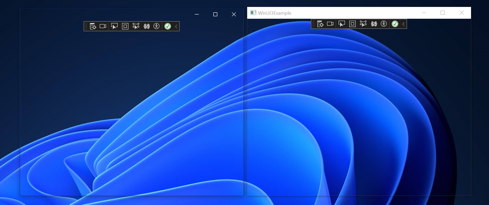

- left: ExtendContentIntoTitleBar
- right: Win32 Titlebar

## UIElementExtension --- *namespace `UIElementExtension`*
See the same class in [Community Toolkit](https://github.com/CommunityToolkit/Windows) for documentation.
Usage:
```xml
<Grid Width="148"
    Height="148"
    essential:UIElementExtension.ClipToBounds="True"
    .../>
```

## Segmented --- *namespace `Segmented`*
Almost like the `Segmented` control in [Community Toolkit](https://github.com/CommunityToolkit/Windows) but with more customizations.

- Animated selected-item transition
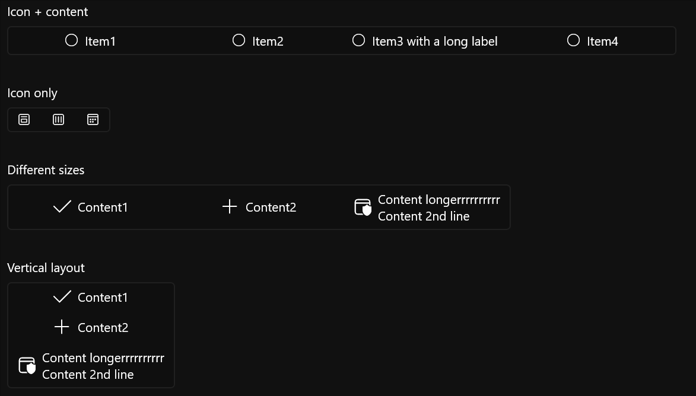
- Does not limited to `Icon + Text`. Use any UIElement
```xml
<essential:SegmentedItem>
    <StackPanel Orientation="Horizontal">
        <FontIcon Glyph="&#xE8C0;"/>
        <TextBlock Text="Week"/>
    </StackPanel>
</essential:SegmentedItem>
```
- Button style has 0 size margin
```xml
<essential:Segmented Style="{StaticResource ButtonSegmentedStyle}">
    <essential:SegmentedItem>
        <StackPanel Orientation="Horizontal" Spacing="4">
            <FontIcon Glyph="&#xE8BF;"/>
            <TextBlock Text="Day"/>
        </StackPanel>
    </essential:SegmentedItem>
    <essential:SegmentedItem>
        <StackPanel Orientation="Horizontal" Spacing="4">
            <FontIcon Glyph="&#xE8C0;"/>
            <TextBlock Text="Week"/>
        </StackPanel>
    </essential:SegmentedItem>
    <essential:SegmentedItem>
        <StackPanel Orientation="Horizontal" Spacing="4}">
            <FontIcon Glyph="&#xE787;"/>
            <TextBlock Text="Month"/>
        </StackPanel>
    </essential:SegmentedItem>
</essential:Segmented>
```
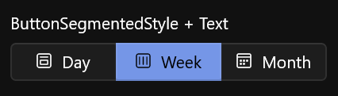
- Support vertical layout
```xml
<essential:Segmented>
    <essential:SegmentedItem>
        <StackPanel Orientation="Horizontal" Spacing="7">
            <SymbolIcon Symbol="Accept"/>
            <TextBlock Text="Content1"/>
        </StackPanel>
    </essential:SegmentedItem>

    <essential:SegmentedItem>
        <StackPanel Orientation="Horizontal" Spacing="7">
            <SymbolIcon Symbol="Add"/>
            <TextBlock Text="Content2"/>
        </StackPanel>
    </essential:SegmentedItem>

    <essential:SegmentedItem>
        <StackPanel Orientation="Horizontal" Spacing="7">
            <SymbolIcon Symbol="Admin"/>
            <StackPanel Orientation="Vertical">
                <TextBlock Text="Content longerrrrrrrrrr"/>
                <TextBlock Text="Content 2nd line"/>
            </StackPanel>
        </StackPanel>
    </essential:SegmentedItem>

    <essential:Segmented.ItemsPanel>
        <ItemsPanelTemplate>
            <StackPanel Orientation="Vertical"/>
        </ItemsPanelTemplate>
    </essential:Segmented.ItemsPanel>
</essential:Segmented>
```
- Allow reordering items
```xml
<essential:Segmented CanReorderItems="True" AllowDrop="True"
    ...
```

Usage:
- Add this to `App.xaml` (UWP)
```xml
<Application.Resources>
    <controls:XamlControlsResources>
        <controls:XamlControlsResources.MergedDictionaries>
            <ResourceDictionary Source="ms-appx:///UWPPackage/Segmented_Resource.xaml"/>
            ...
        </controls:XamlControlsResources.MergedDictionaries>
    </controls:XamlControlsResources>
</Application.Resources>
```

## CustomAcrylicBackdrop
A customizable acrylic backdrop with bindable properties, and can be set as active when the window is inactive.

|Property| Type | DependencyProperty? |
|---|---|---|
|FallbackColor| Color | :white_check_mark:
|TintColor| Color | :white_check_mark:
|Kind| DesktopAcrylicKind | :white_check_mark:
|LuminosityOpacity| Single | :white_check_mark:
|TintOpacity| Single | :white_check_mark:
|EnableWhenInactive| Boolean | :white_check_mark:

## CustomMicaBackdrop

A customizable mica backdrop with bindable properties, and can be set as active when the window is inactive.

|Property| Type | DependencyProperty? |
|---|---|---|
|FallbackColor| Color | :white_check_mark:
|TintColor| Color | :white_check_mark:
|Kind| MicaKind | :white_check_mark:
|LuminosityOpacity| Single | :white_check_mark:
|TintOpacity| Single | :white_check_mark:
|EnableWhenInactive| Boolean | :white_check_mark:

## Shimmer
Similar to the `Shimmer` in Community Toolkit, but it's a `ContentControl`, which allows you to directly put content into it, making it easier to use.
Also, the `ShimmerGradientStops` is a resource of type `Windows.UI.Xaml.Media.GradientStopCollection` which allows to be override.

|Property| Type | DependencyProperty? |
|---|---|---|
|IsLoading| Boolean | :white_check_mark:

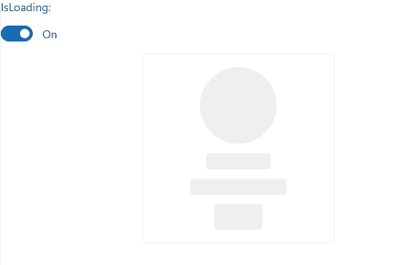
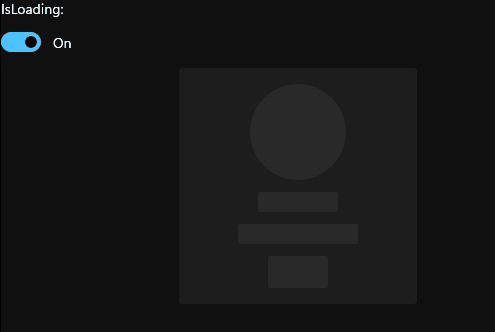

## ScopedButtonDisabler
```cpp
#include <ScopedButtonDisabler.hpp>
```
This is a simple header-only RAII-style class that disable a button in a scope.
When you attach a `Click` handler of a button and open a `FilePicker`, when user click fast enough, it will have 2 `FilePicker` opened at the same time, which is a source of logical bugs.
```cpp
winrt::Windows::Storage::Pickers::FileOpenPicker picker;
picker.FileTypeFilter().Append(L"*");
auto file = co_await picker.PickSingleFileAsync();
```

With `ScopedButtonDisabler`, it will disable the button inside this handler, preventing any logical bugs that might happens.
```cpp
ScopedButtonDisabler disabler{ sender };
winrt::Windows::Storage::Pickers::FileOpenPicker picker;
picker.FileTypeFilter().Append(L"*");
auto file = co_await picker.PickSingleFileAsync();
```


## ImageExtension
Automatically display a fallback image when `Image` failed to load.
Usage:

```xml
<Image
    essential:ImageExtension.FallbackSource="ms-appx:///Assets/Owl.jpg"
    Source="https://upload.wikimedia.org/wikipedia/commons/5/5f/Windows_logo_-_2012.svg" />
```

## SwitchPresenter
Almost the same as community's `SwitchPresenter`. But lacking reflection in C++ means you need to explicitly write out the value type in xaml in `Case.Value` property.

For example, if you binding the `SwitchPresenter.Value` to a `Boolean`, you need to write the `Case.Value` to `<x:Boolean>True</x:String>`:
```xml
<essential:SwitchPresenter Value="{Binding IsOn, ElementName=LoadingState, Mode=OneWay}">
    <essential:Case>
        <essential:Case.Value>
            <x:Boolean>True</x:Boolean>
        </essential:Case.Value>
        <TextBlock Text="True value content">
    </essential:Case>
</essential:SwitchPresenter>
```
You should most likely use `Binding` instead of `x:Bind`, because when `{x:Bind}` is evaluated the controls are not finished loading, causing a crash

## ModernStandardWindowContextMenu
A modern XAML-based window context menu to replace the traditional win32 menu when you right-click the window titlebar. 
It supports uses on both `Essential:WindowEx` and a normal `Microsoft.UI.Xaml.Window`. 
The icons are hard-coded glyphs so you get the same appearance on both Windows 10 & Windows 11.
It also listens to window style changes, so it shows the correct menu item in whatever window styles your window have.

- To use with a `essential:Window`, simply set it to `WindowEx.ContextMenu`
```xml
<essential:WindowEx ...
    <essential:WindowEx.ContextMenu>
        <!--  Simply set it to WindowEx.ContextMenu  -->
        <essential:ModernStandardWindowContextMenu />
    </essential:WindowEx.ContextMenu>
</essential:WindowEx>
```
- To use with a `Microsoft.UI.Xaml.Window`, declare it as a `Resource` with a `x:Name` and `{x:Bind}` to `ModernStandardWindowContextMenu.Window` property 
  under **the first element in the window context**
```xml
<Window ...>
    <StackPanel>
        <StackPanel.Resources>
            <!--  Simply declare it as resource in your first control of the window  -->
            <essential:ModernStandardWindowContextMenu x:Name="Menu" Window="{x:Bind}" />
        </StackPanel.Resources>
    </StackPanel>
</Window>
```

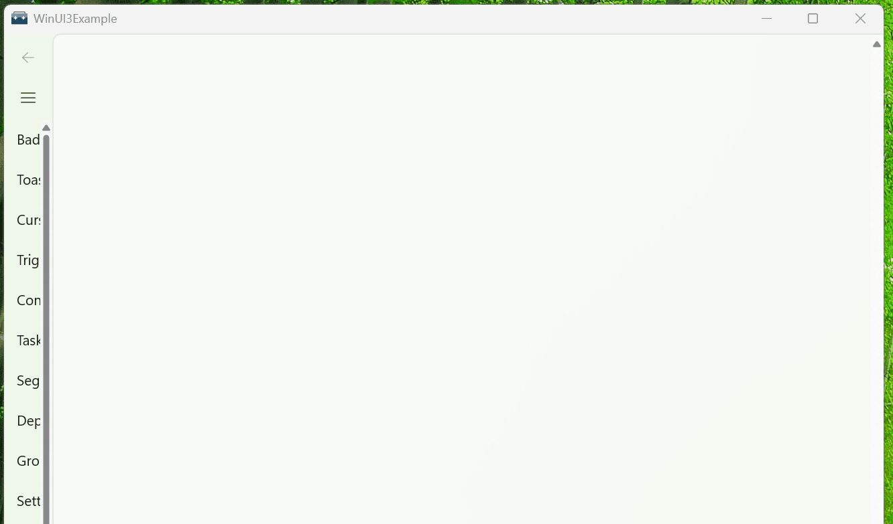

## WindowContextMenu
A customized version of `ModernStandardWindowContextMenu` that allows you to use a custom `MenuFlyout` with any items you'd like.
Usage are largely the same to `ModernStandardWindowContextMenu`, that you still bind a `Window` with `{x:Bind}`,
but you do not need to add a resource to `Application.Resources`
```xml
<Window ...>
    <StackPanel>
        <StackPanel.Resources>
            <essential:WindowContextMenu x:Name="Menu" Window="{x:Bind}">
                <MenuFlyout>
                    <MenuFlyoutItem Text="Item1" />
                    <MenuFlyoutItem Text="Item2" />
                </MenuFlyout>
            </essential:WindowContextMenu>
        </StackPanel.Resources>
    </StackPanel>
</Window>
```

## NonResizableWindowWhiteBorderWorkaround
WASDK 1.6 has [this issue](https://github.com/microsoft/microsoft-ui-xaml/issues/9978) that window has a white border when you `SetBorderAndTitleBar(false, false)`.
This controls helps to workaround it by providing a simple syntax you declare right in your window's first element's `Resource`
```xml
<Window ...>

    <StackPanel>
        <StackPanel.Resources>
            <essential:NonResizableWindowWhiteBorderWorkaround x:Name="Workaround" Window="{x:Bind}" />
        </StackPanel.Resources>
    </StackPanel>
</Window>
```

Before:

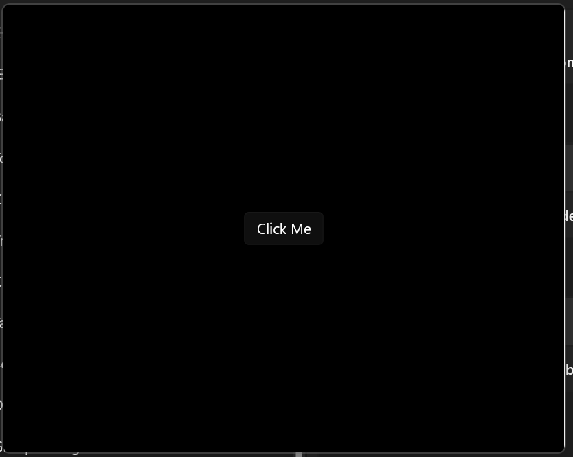

After:

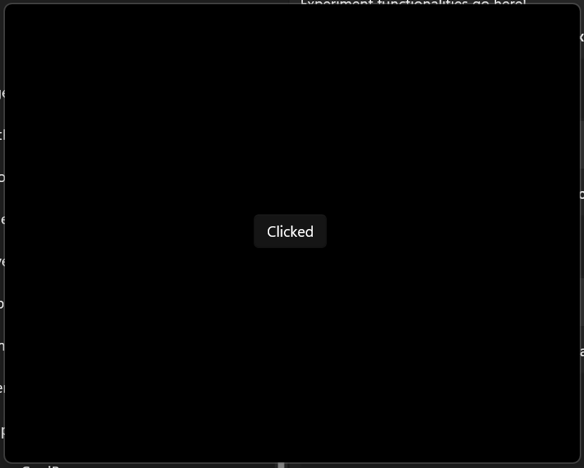

## ComboBoxHelper
The WinUI3's built-in `ComboBox` does not have [Acrylic background](https://github.com/microsoft/microsoft-ui-xaml/issues/9523). We fixed it for you. To use it, simply add `ComboBoxHelper.AcrylicWorkaround="True"` as an attached property on your `ComboBox`.

```xml
<ComboBox
    Width="200"
    essential:ComboBoxHelper.AcrylicWorkaround="True"
    Header="Colors"
    PlaceholderText="Pick a color">
    <x:String>Blue</x:String>
    <x:String>Green</x:String>
    <x:String>Red</x:String>
    <x:String>Yellow</x:String>
</ComboBox>
```
|Before|After|
|------|-----|
|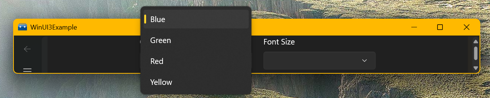|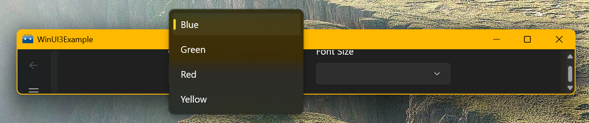|

## AutoSuggestBoxHelper
The WinUI3's built-in `AutoSuggestBox` does not have [Acrylic background](https://github.com/microsoft/microsoft-ui-xaml/issues/10590). We fixed it for you. To use it, simply add `AutoSuggestBoxHelper.AcrylicWorkaround="True"` as an attached property on your `AutoSuggestBox`.

```xml
<AutoSuggestBox x:Name="Control2" Width="300"
    essential:AutoSuggestBoxHelper.AcrylicWorkaround="True"/>
```
|Before|After|
|------|-----|
|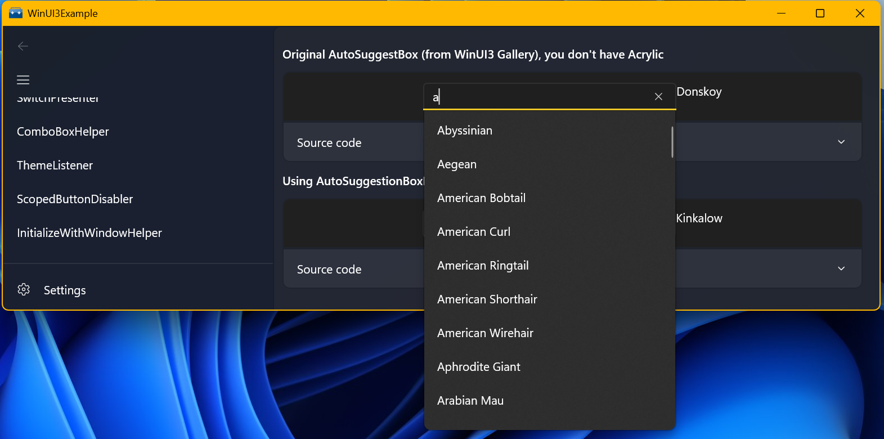|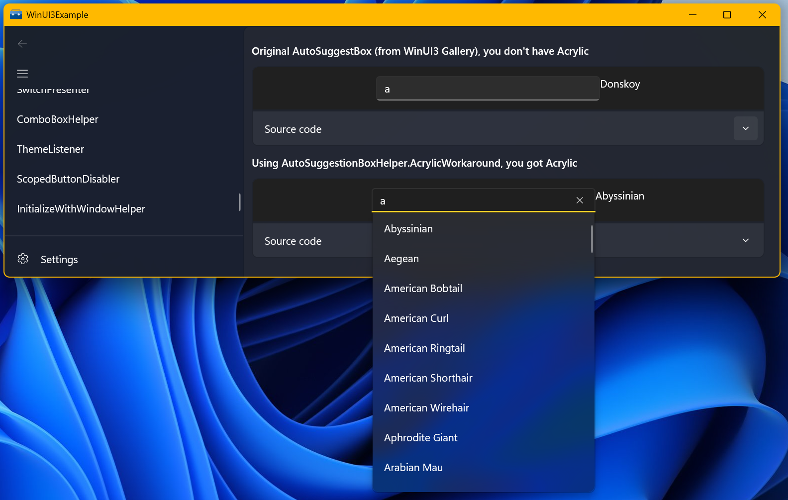|

## WrapPanel
A panel that position child elements from left to right first then wrap to new row when the width is not enough.
Switching orientation to position child elements from top to bottom first then wrap to new column when the height is not enough.

A better implementation to community toolkit that does NOT crash!

Usage:
```xml
 <ListView ItemsSource="{x:Bind WrapPanelCollection, Mode=OneWay}">
    <ListView.ItemsPanel>
        <ItemsPanelTemplate>
            <essential:WrapPanel x:Name="sampleWrapPanel" />
        </ItemsPanelTemplate>
    </ListView.ItemsPanel>
</ListView>
```


## ToolTipHelper
The WinUI3's built-in `ToolTip` does not have Acrylic background. We fixed it for you. To use it, simply add `ToolTipHelper.AcrylicWorkaround="True"` as an attached property on your `ToolTip`.
```xml
<Button Content="Button with a simple ToolTip.">
    <ToolTipService.ToolTip>
        <ToolTip essential:ToolTipHelper.AcrylicWorkaround="True" Content="Simple ToolTip" />
    </ToolTipService.ToolTip>
</Button>
```
|Before|After|
|------|-----|
|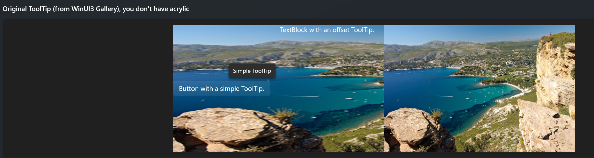|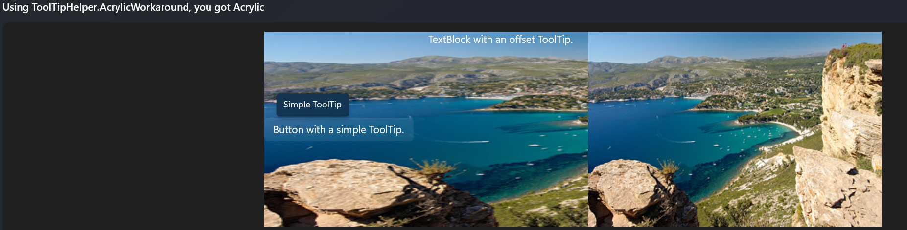|

## CommandBarHelper
The WinUI3's built-in `CommandBar` does not have Acrylic background. We fixed it for you. To use it, simply add `CommandBarHelper.AcrylicWorkaround="True"` as an attached property on your `CommandBar`.
```xml
<CommandBar essential:CommandBarHelper.AcrylicWorkaround="True">
    <AppBarButton Icon="Add" Label="Add"/>
    <AppBarButton Icon="Edit" Label="Edit"/>
    <AppBarButton Icon="Delete" Label="Delete"/>
</CommandBar>
```
|Before|After|
|------|-----|
|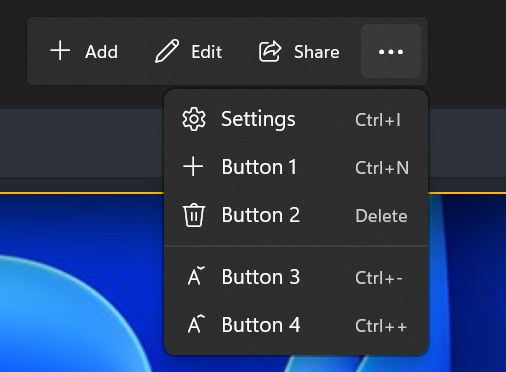|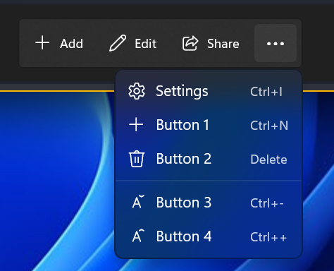|

## IInitializeWithWindowHelper
A header-only helper for [initializing](https://learn.microsoft.com/en-us/windows/apps/develop/ui-input/display-ui-objects) WinRT objects that requires a `hwnd`.

To use, simply change the namespace `winrt` to `WinUIEssentials` of your objects that needs to be initialized, and pass either a `HWND` or a `Microsoft.UI.Xaml.Window` to the constructor.

Take `FileOpenPicker` as an example:
```cpp
#include <include/IInitializeWithWindowHelper.hpp>

WinUIEssentials::Windows::Storage::Pickers::FileOpenPicker picker{ MainWindow::Hwnd };
//or
WinUIEssentials::Windows::Storage::Pickers::FileOpenPicker picker{ MainWindow::Instance };

//...
picker.PickSingleFileAsync();
```

## WindowCaptionButtonThemeWorkaround
When you have `Window.ExtendsContentIntoTitleBar(true)`, the caption buttons often comes out with broken color regarding to theme. 
This helper fixed it by working as a hidden control and listens to theme change message, and make corresponding changes to caption buttons.

To use, simply put it under a Xaml control (such as `Grid`) that can accept child contents.

For UWP:

```xml
<Page>
    ...
    <Grid x:Name="RootGrid">
        <essential:WindowCaptionButtonThemeWorkaround />
    </Grid>
</Page>
```


For WinUI3:

```xml
<Window>
    ...
    <Grid x:Name="RootGrid">
        <essential:WindowCaptionButtonThemeWorkaround Window="{x:Bind}" />
        <-- Other contents -->
    </Grid>
</Window>
```

|Before|After|
|------|-----|
|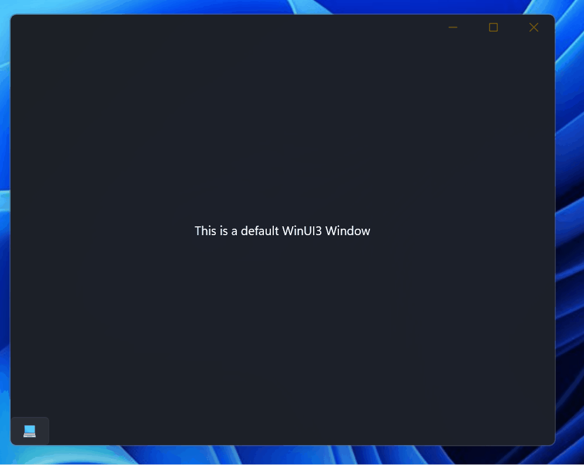|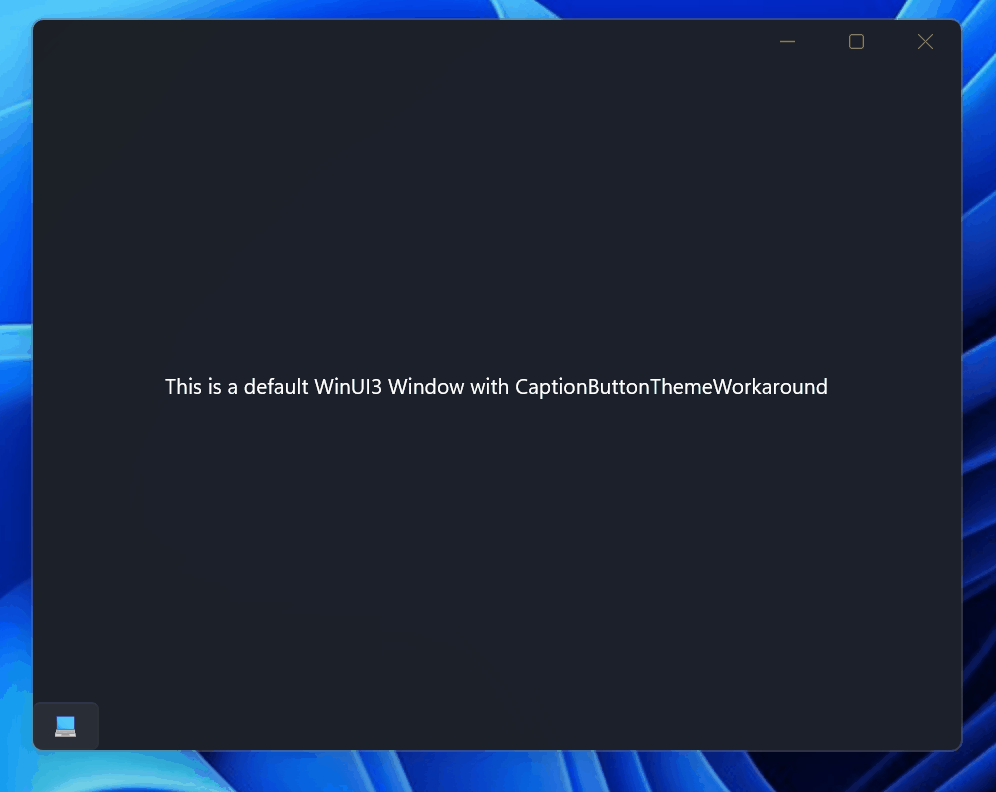|

## MicaBackdropWithFallback
The default mica backdrop, but with automatic fallback to any other kind of backdrop (mainly `DesktopAcrylicBackdrop` from WASDK).

Usage: 
```xml
<Window.SystemBackdrop>
    <essential:MicaBackdropWithFallback>
        <essential:MicaBackdropWithFallback.Fallback>
            <DesktopAcrylicBackdrop />
        </essential:MicaBackdropWithFallback.Fallback>
    </essential:MicaBackdropWithFallback>
</Window.SystemBackdrop>
```

## NonMaximizableWindowWorkaround
Helper for workaround setting `IsMaximizable=false` but you are still able to maximize the window but double-tapping on the title bar.


Simply delcare it under any `Resource` under a control that is inside a `Window`. Usage:
```xml
<Window ...>
    <StackPanel>
        <StackPanel.Resource>
            <essential:NonMaximizableWindowWorkaround Window="{x:Bind}"/>
        </StackPanel.Resource>
    </StackPanel>
    ...
</Window>
```

## DatePickerHelper
The WinUI3's built-in `DatePicker` does not have Acrylic background. We fixed it for you. To use it, simply add `DatePickerHelper.AcrylicWorkaround="True"` as an attached property on your `DatePicker`.
```xml
<DatePicker essential:DatePickerHelper.AcrylicWorkaround="True" Header="Pick a date" />
```
|Before|After|
|------|-----|
|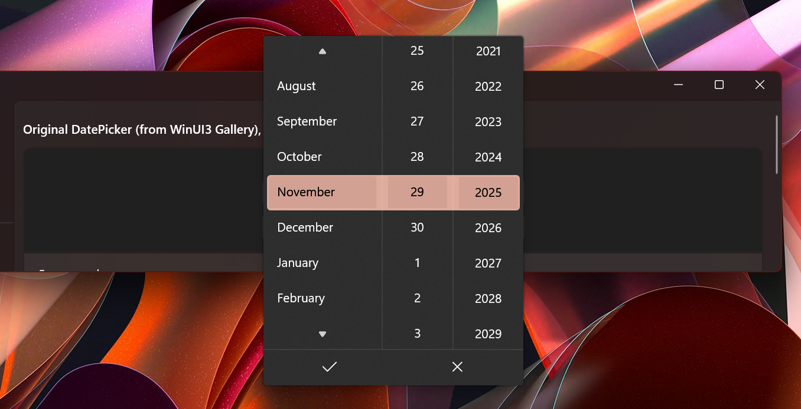|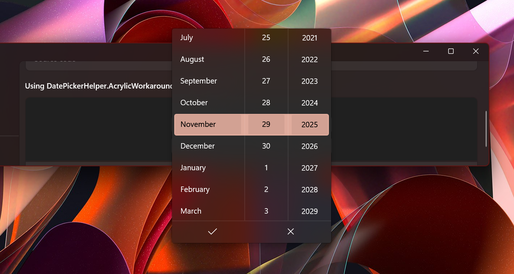|

## TimePickerHelper
The WinUI3's built-in `TimePicker` does not have Acrylic background. We fixed it for you. To use it, simply add `TimePickerHelper.AcrylicWorkaround="True"` as an attached property on your `TimePicker`.
```xml
<TimePicker essential:TimePickerHelper.AcrylicWorkaround="True" Header="Pick a time" />
```
|Before|After|
|------|-----|
|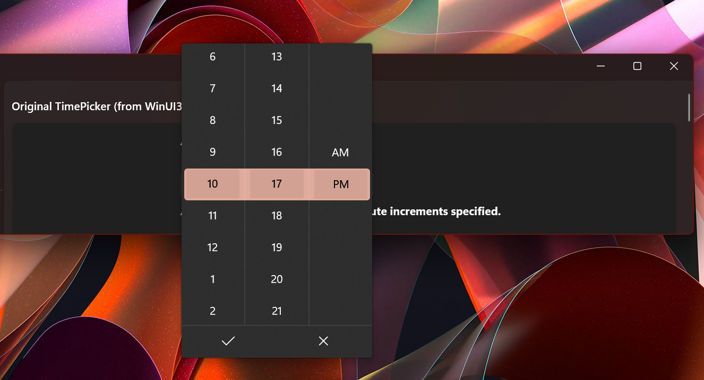|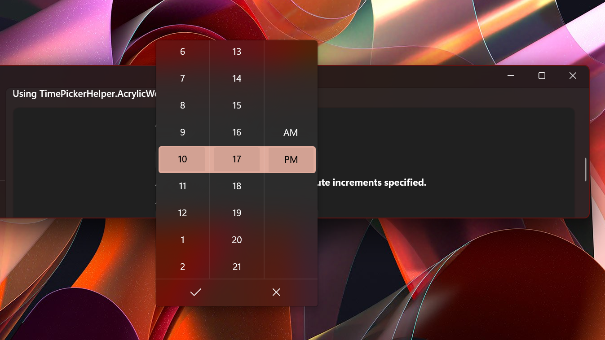|

## FlyoutHelper
The WinUI3's built-in `Flyout` does not have Acrylic background. We fixed it for you. To use it, simply add `Flyout.AcrylicWorkaround="True"` as an attached property on your `Flyout`.
```xml
<Flyout essential:FlyoutHelper.AcrylicWorkaround="True">
    <StackPanel>
        <TextBlock
            Margin="0,0,0,12"
            Style="{ThemeResource BaseTextBlockStyle}"
            Text="All items will be removed. Do you want to continue?" />
        <Button Content="Yes, empty my cart" />
    </StackPanel>
</Flyout>
```
|Before|After|
|------|-----|
|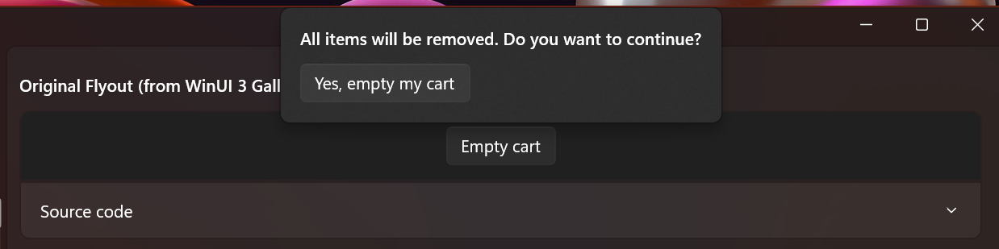|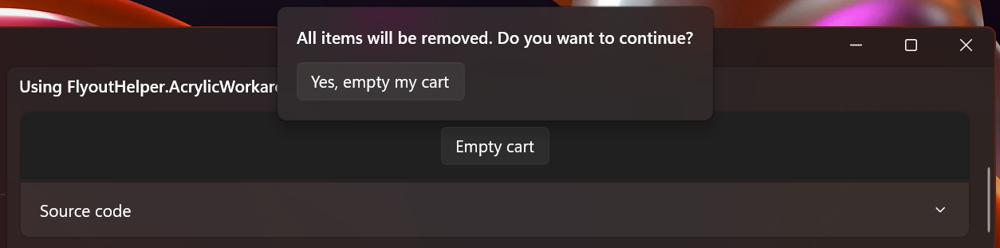|

## CalendarDatePickerHelper
The WinUI3's built-in `TimePickerHelper` does not have Acrylic background. We fixed it for you. To use it, simply add `TimePickerHelper.AcrylicWorkaround="True"` as an attached property on your `TimePickerHelper`.
```xml
<CalendarDatePicker
    essential:CalendarDatePickerHelper.AcrylicWorkaround="True"
    Header="Calendar"
    PlaceholderText="Pick a date" />
```
|Before|After|
|------|-----|
|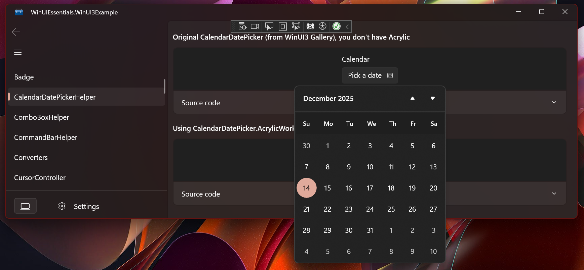|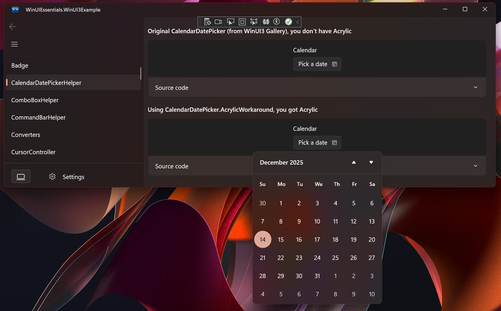|

## ModalWindow
A WinUI3 modal window (meaning that it has an owner window, and take its focus) that you can directly use in xaml, just like the good-ol `Window`.
```xml
<essential:ModalWindow
    x:Class="WinUI3Example.SampleModalWindow"
    xmlns="http://schemas.microsoft.com/winfx/2006/xaml/presentation"
    xmlns:x="http://schemas.microsoft.com/winfx/2006/xaml"
    xmlns:d="http://schemas.microsoft.com/expression/blend/2008"
    xmlns:essential="using:WinUI3Package"
    xmlns:local="using:WinUI3Example"
    xmlns:mc="http://schemas.openxmlformats.org/markup-compatibility/2006"
    Title="Sample Modal Window"
    mc:Ignorable="d">

    <TextBlock Text="This is a ModalWindow" />
</essential:ModalWindow>
```

## NavigationViewHelper
The WinUI3's built-in `NavigationView` does not have Acrylic background with the dropdown menu and the overflow menu when it's at top. We fixed it for you. To use it, simply add `TimePickerHelper.AcrylicWorkaround="True"` as an attached property on your `NavigationView` when it has `PaneDisplayMode="Top"`.
```xml
<NavigationView
    ...
    essential:NavigationViewHelper.AcrylicWorkaround="True"
    PaneDisplayMode="Top">

    ...Other contents...
</NavigationView>
```
|Before|After|
|------|-----|
|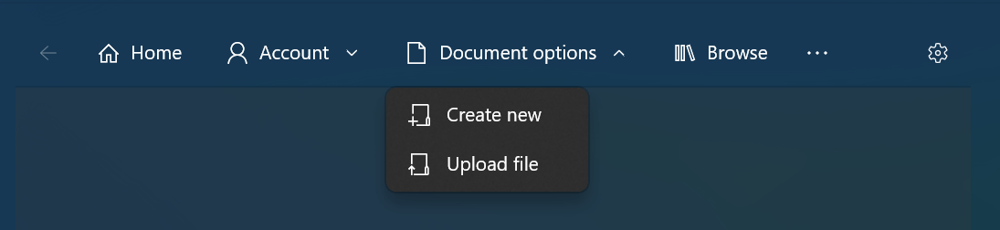|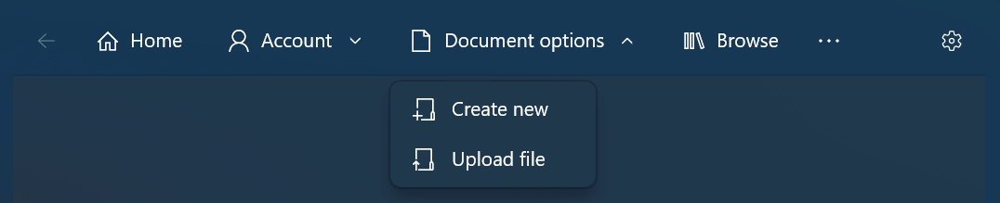|

## SliderHelper
The WinUI3's built-in `Slider` does not have Acrylic background on its tooltip. We fixed it for you. To use it, simply add `SliderHelper.AcrylicWorkaround="True"` as an attached property on your `Slider`.
```xml
<Slider
    Width="200"
    VerticalAlignment="Center"
    essential:SliderHelper.AcrylicWorkaround="True" />
```
|Before|After|
|------|-----|
|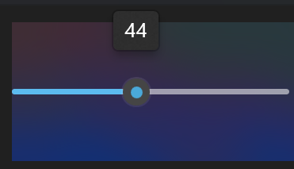|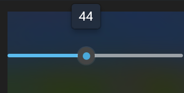|


## RevealFocusPanel
Missing the good-ol Reveal Focus effect from UWP? We bring it back to you! For detailed usage, please download the [Example Gallery](https://apps.microsoft.com/detail/9PCC690BCMT9?hl=en-us&gl=US&ocid=pdpshare) and see for yourself!
|Light|Dark|
|-----|----|
|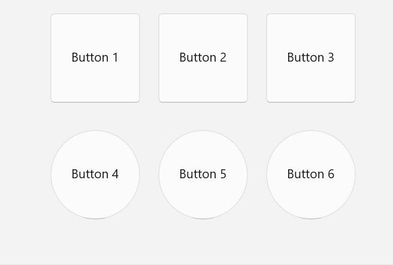|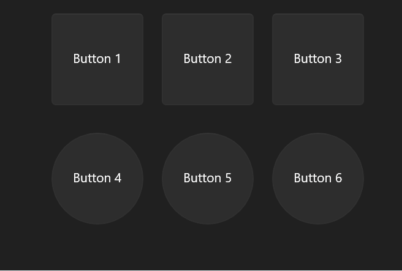|
|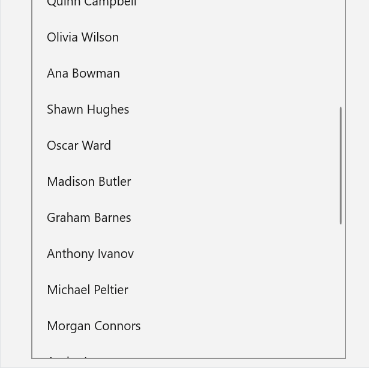|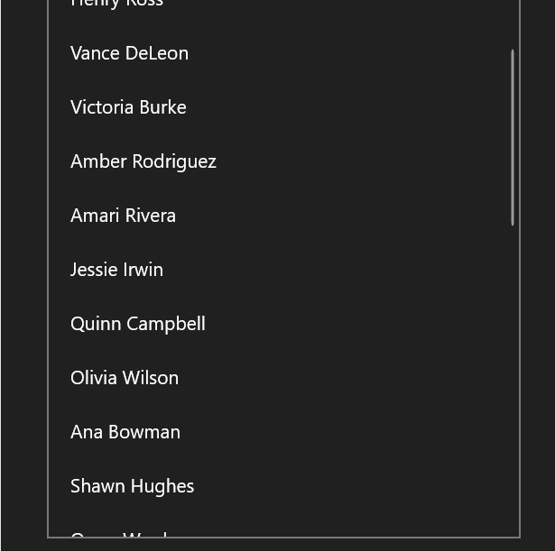|
|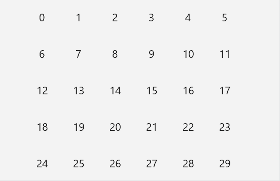|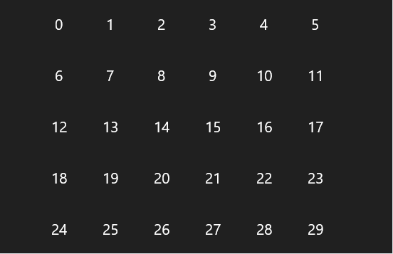|


## TenMica
Simulated [Mica effect](https://learn.microsoft.com/en-us/windows/apps/design/style/mica) for Windows 10 (that also works on Windows 11 if you want to force the effect even when the user disabled it in system settings). 
This is a drop-in replacement for WinUI3's built-in `MicaBackdrop`, and it automatically handles:
- Cross-screen window moving with different dpi
- Wallpaper changes
- Theme changes
- Monitor changes
- GPU driver reset / GPU changes
- Works with software (no GPU) and hardware rendering

```xml
<Window ...>
    <Window.SystemBackdrop>
        <essential:TenMicaBackdrop BindThemeTo="{x:Bind RootGrid}" EnableWhenInactive="{x:Bind EnableInactiveSwitch.IsOn, Mode=OneWay}" />
    </Window.SystemBackdrop>

    ...
</Window>
```

|Light|Dark|
|-----|----|
|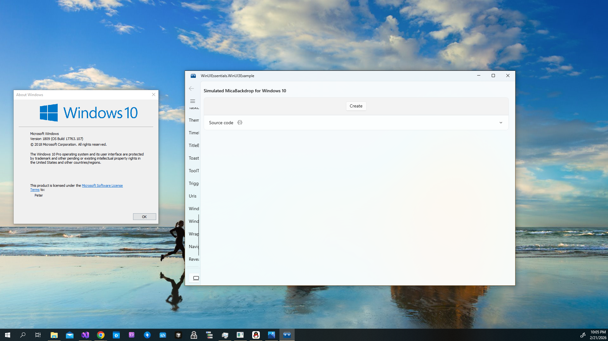|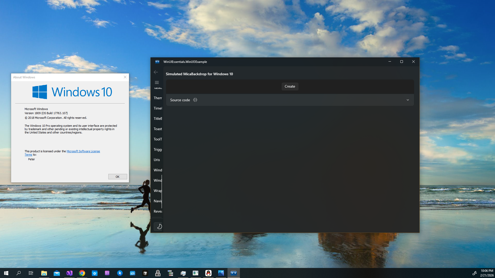|

## WindowedContentDialog
`ContentDialog` but shown inside a window that has exactly the same `ShowAsync()` api that you are familiar with.
- If you `ShowAsync()` with a parent window, it automatically center (but clamped to visible monitor area) inside the parent, theme synced with the parent, and you can also specify the underlay (with a nice animation)
- If you `ShowAsync()` without a parent window, it shows as a free top-level window.

```idl
Windows.Foundation.IAsyncOperation<Microsoft.UI.Xaml.Controls.ContentDialogResult> ShowAsync();
Windows.Foundation.IAsyncOperation<Microsoft.UI.Xaml.Controls.ContentDialogResult> ShowAsync(Microsoft.UI.Xaml.Window parentWindow);
Windows.Foundation.IAsyncOperation<Microsoft.UI.Xaml.Controls.ContentDialogResult> ShowAsync(
    Microsoft.UI.Xaml.Window parentWindow,
    UnderlayMode underlay
);
```
|UnderlayMode|
|------------|
|None|
|Blur|
|Smoke|


|Smoke|Blur|
|-----|----|
|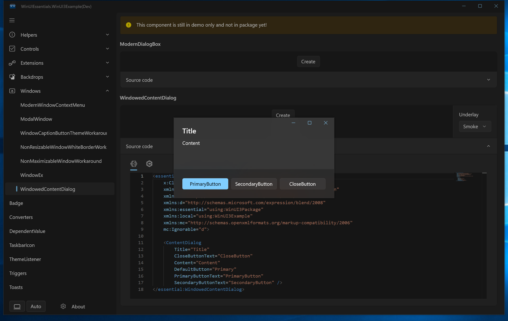|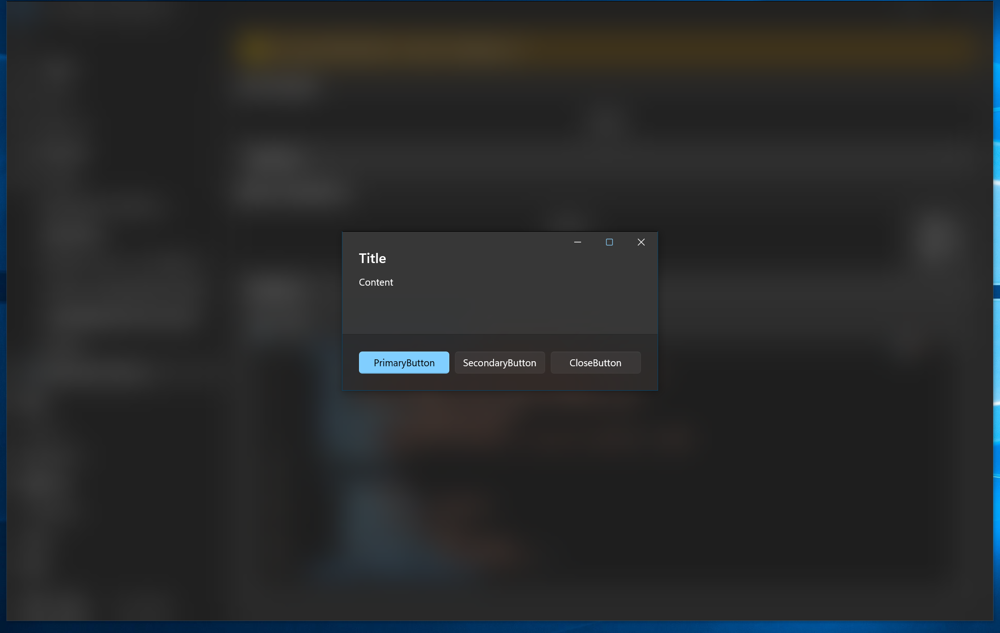

## SvgImageSource
**This component is in a dedicated `WinUIEssential.WinUI3.Svg` package.**

This component is based on [the great resvg project](https://github.com/linebender/resvg). 
It is meant to be a drop-in replacement for the WinUI3's built-in `SvgImageSource`, but offers much better rendering capabilities.
The WinUI3's built-in `SvgImageSource` has these [known limitations](https://learn.microsoft.com/en-us/windows/win32/direct2d/svg-support), one of the most limiting one being:
 **unable to render `<text>`**.

 Using this component, you get the majority of svg1.1 features supported (download the WinEssentials.WinUI3Example app from the store and see for yourself), plus easier sizing control,
 supporting binding the rasterization size directly with the `Image` control.

 Example usage:
 ```xml
<Image x:Name="SvgUrlImage">
    <Image.Source>
        <svg:SvgImageSource BindSizeTo="{x:Bind SvgUrlImage}" UriSource="https://img.shields.io/nuget/v/WinUIEssential.WinUI3?label=WinUIEssential.WinUI3" />
    </Image.Source>
</Image>
 ```

 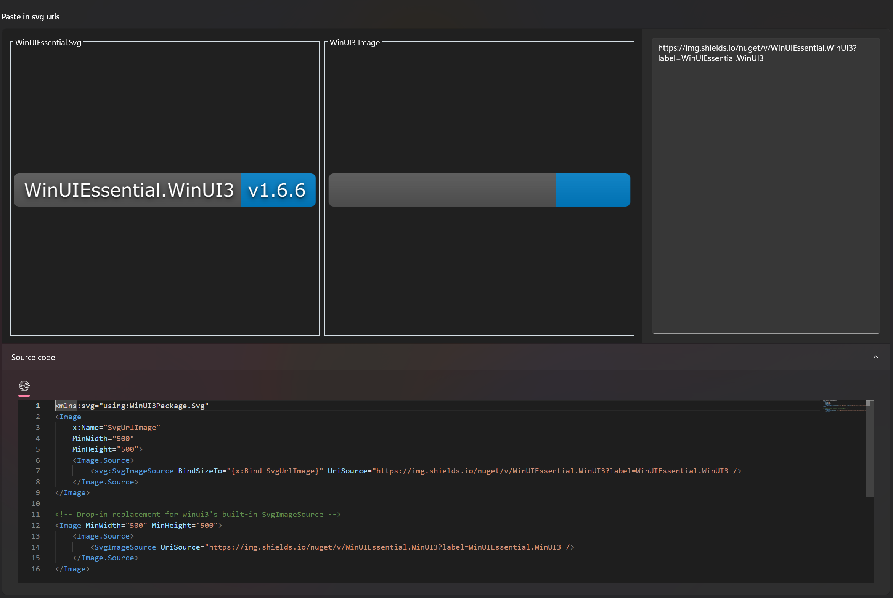
 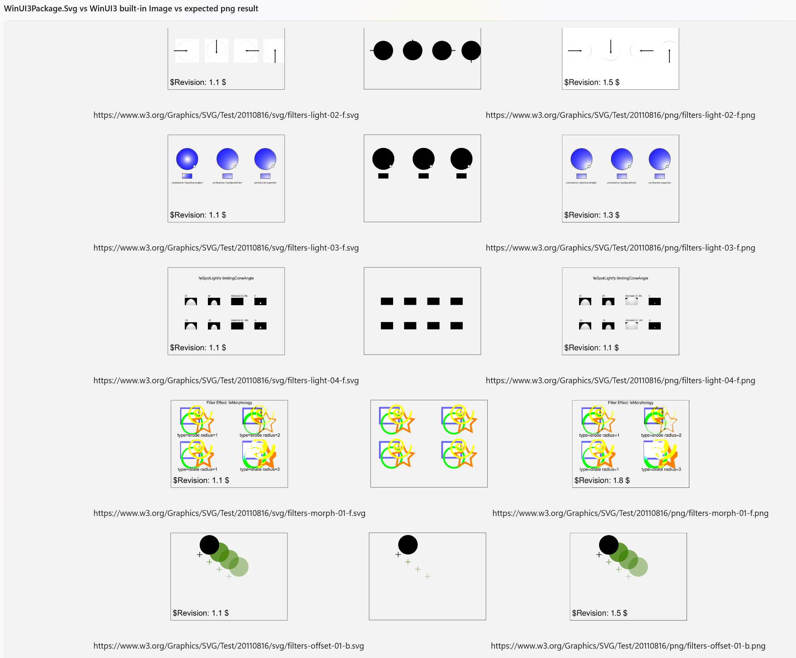

|Property| DependencyProperty? | Description
|---|---|---|
|UriSource | :white_check_mark: | Set the svg source by `Uri`
|StringSource | :white_check_mark: | Set the svg source by the svg content string
|RasterizePixelWidth | :white_check_mark: | The pixel width of the svg rasterized, not compatible with `BindSizeTo`
|RasterizePixelHeight | :white_check_mark: | The pixel height of the svg rasterized, not compatible with `BindSizeTo`
|BindSizeTo | :white_check_mark: | The `Image` control to bind to automatically adjust rasterized size. Not compatible with `RasterizedPixelWidth` and `RasterizedPixelHeight`

## WebView
I brought back the WebView (based on legacy EdgeHTML) control, and it should have exactly the same API
surfaces (except for `CornerRadius`) as the `Windows.UI.Xaml.Controls.WebView` in UWP.
It is more efficient and has better performance than WebView2, making it more preferrable the web content 
you are showing is simple and target older version of browsers.

Usage:
```xml
<essential:WebView Source="https://www.microsoft.com" />
```

### Properties
|Property| Type | DependencyProperty? | Description
|---|---|---|---|
|Source | Windows.Foundation.Uri | :white_check_mark: | The `Uri` currently navigated to; set it to navigate
|CanGoBack | Boolean | :white_check_mark: | `true` if there is a page to navigate back to (read-only)
|CanGoForward | Boolean | :white_check_mark: | `true` if there is a page to navigate forward to (read-only)
|ContainsFullScreenElement | Boolean | :white_check_mark: | `true` while the page has an element in full-screen mode (read-only)
|DocumentTitle | String | :white_check_mark: | The title of the current document (read-only)
|DefaultBackgroundColor | Windows.UI.Color | :white_check_mark: | The background color shown before/behind page content
|DeferredPermissionRequests | IVector\<WebViewDeferredPermissionRequest\> | :x: | The permission requests that were deferred (read-only)
|Settings | Windows.Web.UI.WebViewControlSettings | :x: | The underlying control settings, e.g. scripting/IndexedDB toggles (read-only)

### Methods
|Method| Description
|---|---|
|void Navigate(Uri source) | Navigate to the given `Uri`
|void NavigateToString(String text) | Load the given HTML string as the page content
|void NavigateToLocalStreamUri(Uri source, IUriToStreamResolver streamResolver) | Navigate to a local `ms-local-stream://` `Uri` resolved through a custom resolver
|void NavigateWithHttpRequestMessage(HttpRequestMessage requestMessage) | Navigate using a fully-specified HTTP request
|Uri BuildLocalStreamUri(String contentIdentifier, String relativePath) | Build an `ms-local-stream://` `Uri` for use with `NavigateToLocalStreamUri`
|void GoBack() | Navigate to the previous page in history
|void GoForward() | Navigate to the next page in history
|void Refresh() | Reload the current page
|void Stop() | Stop the current navigation
|void Close() | Close the webview and release the underlying process
|void AddInitializeScript(String script) | Register a script that runs before any page script on every navigation
|IAsyncOperation\<String\> InvokeScriptAsync(String scriptName, IIterable\<String\> arguments) | Invoke a JavaScript function on the current page and return its result
|IAsyncAction CapturePreviewToStreamAsync(IRandomAccessStream stream) | Write a preview image of the current page into the stream
|IAsyncOperation\<DataPackage\> CaptureSelectedContentToDataPackageAsync() | Capture the current selection into a `DataPackage`
|void MoveFocus(WebViewControlMoveFocusReason reason) | Move focus into the webview content
|void GetDeferredPermissionRequestById(UInt32 id, out WebViewControlDeferredPermissionRequest request) | Retrieve a previously deferred permission request by id

### Events
|Event| EventArgs | Description
|---|---|---|
|NavigationStarting | WebViewControlNavigationStartingEventArgs | The top-level page is about to navigate; cancelable
|ContentLoading | WebViewControlContentLoadingEventArgs | The top-level content has started loading
|DOMContentLoaded | WebViewControlDOMContentLoadedEventArgs | The top-level DOM content has finished loading
|NavigationCompleted | WebViewControlNavigationCompletedEventArgs | The top-level navigation has completed (success or failure)
|FrameNavigationStarting | WebViewControlNavigationStartingEventArgs | A subframe is about to navigate
|FrameContentLoading | WebViewControlContentLoadingEventArgs | A subframe has started loading content
|FrameDOMContentLoaded | WebViewControlDOMContentLoadedEventArgs | A subframe's DOM content has finished loading
|ScriptNotify | WebViewControlScriptNotifyEventArgs | The page called `window.external.notify`
|LongRunningScriptDetected | WebViewControlLongRunningScriptDetectedEventArgs | A long-running script was detected; can be halted
|UnsafeContentWarningDisplaying | / | A SmartScreen unsafe-content warning is being displayed
|UnsupportedUriSchemeIdentified | WebViewControlUnsupportedUriSchemeIdentifiedEventArgs | Navigation to an unsupported URI scheme was requested; cancelable
|UnviewableContentIdentified | WebViewControlUnviewableContentIdentifiedEventArgs | The content cannot be displayed (e.g. a download)
|NewWindowRequested | WebViewControlNewWindowRequestedEventArgs | The page requested a new window; cancelable
|PermissionRequested | WebViewControlPermissionRequestedEventArgs | The page requested a permission (geolocation, media, etc.)
|WebResourceRequested | WebViewControlWebResourceRequestedEventArgs | A web resource is being requested; allows interception
|MoveFocusRequested | WebViewControlMoveFocusRequestedEventArgs | The content requested focus be moved out of the webview

> [!NOTE]
> Right-clicks inside the webview are intercepted so the win32 window context menu is never raised
> (see the `WebViewMouseHook`); this also suppresses the webview's own native context menu within its bounds.

## Table
A lightweight yet extremely high performance Table / DataGrid control for displaying structured data.

### Property
|Property| Type | DependencyProperty? | Description
|---|---|---|---|
|Columns | TableColumnCollection | :x: | Define table columns in xaml|
|ItemsSource | ITableData | :x: | Provide row data in code|
|Items | IVector\<TableRow\> | :x: | Provide row data in xaml|
|HeaderForeground | Windows.UI.Color | :white_check_mark: | \ |
|ContentForeground | Windows.UI.Color | :white_check_mark: | \ |
|HeaderBackground | Windows.UI.Color | :white_check_mark: | \ |
|AlternateRowColors | IVector\<TableAlternateRowColor\> | :white_check_mark: | Define row foreground and background colors|
|HeaderFontSize | Double | :white_check_mark: | \ |
|ContentFontSize | Double | :white_check_mark: | \ |
|HeaderFontStretch | Windows.UI.Text.FontStretch | :white_check_mark: | \ |
|ContentFontStretch | Windows.UI.Text.FontStretch | :white_check_mark: | \ |
|HeaderFontStyle | Windows.UI.Text.FontStyle | :white_check_mark: | \ |
|ContentFontStyle | Windows.UI.Text.FontStyle | :white_check_mark: | \ |
|FontFamily | \<WinUI Namespace\>.UI.Xaml.Media.FontFamily | :white_check_mark: | Controls font family for both the header and content
|ContentPadding | \<WinUI Namespace\>.UI.Xaml.Thickness | :white_check_mark: | Controls text & xaml control padding for both the header and content
|HorizontalLineColor | Windows.UI.Color | :white_check_mark: | Controls the table horizontal lines colors (border line is controled by `Border.BorderBrush`)
|VerticalLineColor | Windows.UI.Color | :white_check_mark: | Controls the table vertical lines colors
|HorizontalLineThickness | Double | :white_check_mark: | Controls the table horizontal lines thickness (border line is controled by `Border.BorderThickness`)
|VerticalLineThickness | Double | :white_check_mark: | Controls the table vertical lines thickness

### Events
`event Windows.Foundation.TypedEventHandler<Table, ContextMenuRequestedEventArgs> ContextMenuRequested`: sent when right-clicked on a table cell.

#### `ContextMenuRequestedEventArgs` object
|Property| Type | Description
|---|---|---|
|RowIndex| Int32 | The row number (starts from 1) of the right-click
|ColumnIndex| Int32 | The column number (starts from 1) of the right-click
|DataContext| Object | The data of the cell content of the right-click
|ContextMenu | WinUINamespace.UI.Xaml.Controls.MenuFlyout | The `MenuFlyout` that you needs to provide for handling this request
|Handled | Boolean | Indicate whether you have handled the request, if set to `true` then the `ContextMenu` will be used. Otherwise this right-click will be treated as no-op.

### Providing data to Table
You can use either `TableRow` objects for mostly static data or implement the `ITableData` interface.

#### `TableRow` object
This class is used for defining table data within xaml. It is basically a container of `Object`, where it can be either a `String` or a xaml Control. 
A `String` type will be rendered directly in direct2d. 
The number of elements in a `TableRow` has to match the number of columns you defined in `Table.Columns`.

#### `ITableData` interface
You implement 4 methods:
1. `Int32 RowCount()`: Return the number of total rows when called
2. `Int32 RowRequested(RowRequestedEventArgs args)`: Return the number of filled rows when called. This is the main mechanism for rendering data in `Table`. We will break it down later.
3. `void SetData(Int32 row, Int32 column, Object data)`: Called when there is an update to a table cell. This is analogous to a `TwoWay` binding in xaml.
4. `event Windows.Foundation.EventHandler<UpdateRowDataEventArgs> UpdateRowData`: This is for you to raise a data change for a specific cell data update. After this event gets raised, `Table` will call `RowRequested` for new data retreival.

##### `RowRequestedEventArgs` object
This is the data request from `Table` to your data. It provides information for this request, and also a function for you to fill-in the actual data.

|Property| Type | Description
|---|---|---|
|StartRow | Int32 | The start row number of the data you need to provide
|EndRow | Int32 | The end row number (inclusive) of the data you need to provide

`void SetRow(Int32 row, Object[] content)`: Fill in one row of data

##### `UpdateRowDataEventArgs` struct
It is simply a pair of `Int32` indicating the start row and end row
|Property| Type | Description
|---|---|---|
|StartRow | Int32 | The start row number of the data you need to provide
|EndRow | Int32 | The end row number (inclusive) of the data you need to provide

#### Defining the columns with `TableColumn` object
|Property| Type | DependencyProperty? | Description
|---|---|---|---|
|Content| Object | :white_check_mark: | It can be either a `String` (rendered with D2D) or any Xaml Controls
|ItemTemplate| DataTemplate | :white_check_mark: | Specify the `DataTemplate` which is used for displaying your cell data of this column
|EditTemplate| DataTemplate | :white_check_mark: | Specify the `DataTemplate` which is used when user double-click a cell to edit it. If not specified, double-clicking is disabled.
|SortEnabled | Boolean | :white_check_mark: | Controls whether this column is sortable
|IsResizable | Boolean | :white_check_mark: | Controls whether this column is resizable
|HorizontalAlignment | HorizontalAlignment | :x: | Controls how the cell content gets horizontally laid out
|MinWidth | Double | :x: | Controls the minimum width this column can be resized to
|MaxWidth | Double | :x: | Controls the maximum width this column can be resized to
|ContextFlyout | WinUINamespace.UI.Xaml.Controls.Flyout | :x: | The right-click flyout to be displayed on this column header. Note: This is different from the table's `ContextMenuRequested` event.