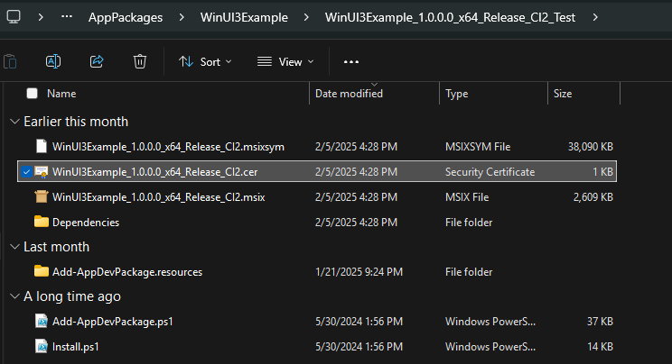
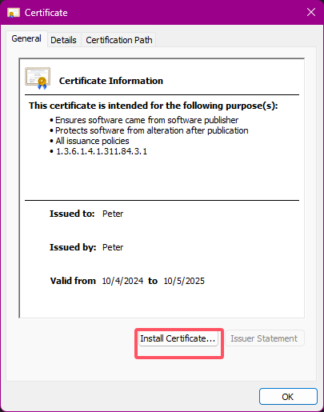
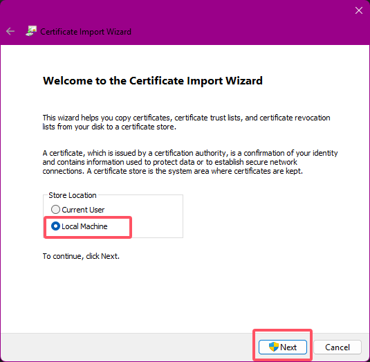
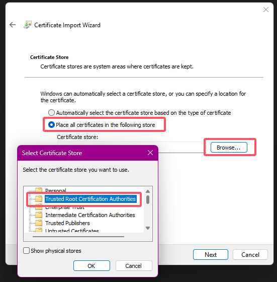
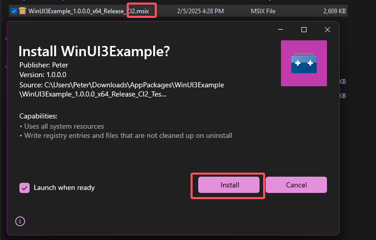

# Sideload test README
You can install [the release package built by Github CI](https://github.com/HO-COOH/WinUIEssentials/releases).

To install:
1. Download the correct package built for your CPU architecture, eg: x64 x86 ARM ARM64
2. Unzip the packages, there will be two projects in the folder, one UWP, one WinUI3
3. In either project, double-click to open the `cert` file
    
4. Click `Install Certificate` 
    
5. In the wizard, choose `Local machine`, click `Next` 
    
6. In the wizrd, choose `Place all certifications in the following store`, click `Browser`, choose `Trusted Root Certification Authorities`, Click `Next`, then close the wizard 
    
7. Now you can double click the `msix` file to install the sample project 
    